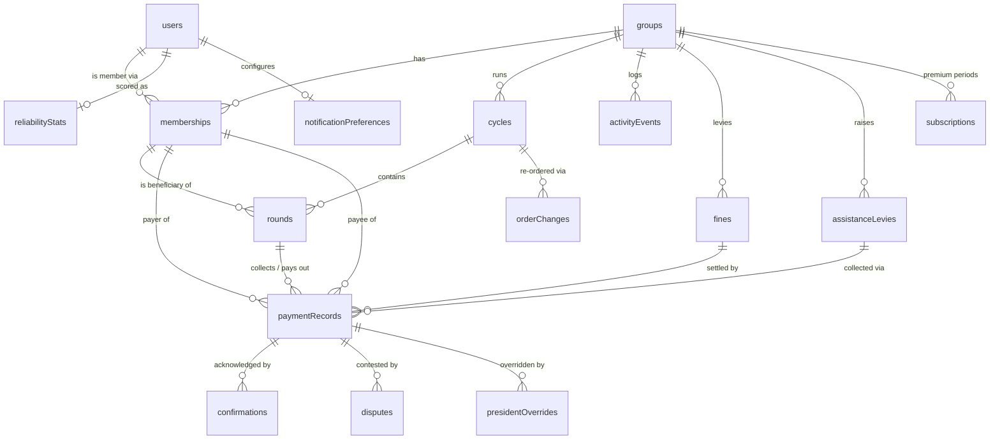

# Domain Model & Convex Schema

> Scope: data layer only. All naming follows the shared glossary. Stack assumptions: Convex single-file schema at `convex/schema.ts`, validators as exported module-level consts (piol-vite convention), pure ledger logic in `convex/lib/` with colocated tests. All money amounts are **integers in XAF** (XAF has no minor unit — never floats, never decimals). All timestamps are ms-epoch `v.number()` with `At` suffix; calendar dates are ISO `YYYY-MM-DD` strings.
>
> **Source-of-truth split:** [02-lifecycle-state-machines.md](02-lifecycle-state-machines.md) is **normative** for all lifecycles, transitions, timers, and notification triggers. This doc is normative for tables, fields, indexes, and invariants, and is a faithful projection of 02 — where the two could drift, 02 wins and this doc must be updated.

---

## 1. Entity-Relationship Overview

**The Group is the aggregate root.** A `group` is one njangi. People exist twice in the model, deliberately: a `user` is a global identity (Clerk-backed, owns a phone, a language, push tokens), while a `membership` is that person *inside one group* (role, display name, rotation participation). Feature-phone members are memberships **without** a `userId` — they have only a phone number, and the treasurer operates on their behalf. (`hasAccount` in 02/05 is the same concept: `hasAccount === (userId !== undefined)` — one fact, two phrasings; this doc stores it as the absence of `userId`.) This split is what makes the reliability score portable across groups while keeping every ledger fact scoped to a group.

**Time is structured as Group → Cycle → Round.** A `cycle` is one full rotation (every member receives once); its rotation order is locked at activation and stored as an ordered array of membership ids. A `round` is one period within a cycle with exactly one beneficiary and three timer fields (`scheduledOpenAt`, `dueAt`, `graceEndAt`). Rounds are generated in bulk when a cycle is activated, with contribution amount, schedule, and collection conventions snapshotted onto the cycle so later group-setting edits never rewrite history. Post-lock changes to the order — swapping two future beneficiaries (« begging the turn ») or removing an exited/deceased member's future round — happen only through immutable `orderChanges` records (president-only, mandatory note, visible to all), per 02 §a.

**Money is one table: `paymentRecords`.** Contributions, payouts, fine settlements, and assistance payments are all rows in the same method-agnostic table, distinguished by `kind`, carrying the two-sided-acknowledgment state machine (`pending → claimed → confirmed`, or `disputed` / `cancelled`). A claim carries `claimedBySide` (02's name, adopted here): payer-side claims (« j'ai envoyé ») auto-dispute on payee silence; payee-side claims (Meeting Mode tick, beneficiary « j'ai reçu ») auto-confirm on payer silence — see §3.2. Proof artifacts (MoMo txn ID, screenshot) hang off the record but are never the source of truth — the counterparty's confirmation is. `confirmations` is an append-only acknowledgment event log; `disputes` tracks contested records to resolution (president-only override). `fines` and `assistanceLevies` are *obligations*; they are settled by paymentRecords that reference them. Confirmed records are immutable — the **only** exit is a president override (`confirmed → cancelled`) recorded in the immutable `presidentOverrides` table (see §3.4).

**Satellite tables:** `activityEvents` (the single immutable event log — 02's `transitions` log, the group feed source, and the pilot-metrics source in one table), `orderChanges`, `presidentOverrides`, `reliabilityStats` (portable counters keyed by user *or* phone), `notificationPreferences` (per user), `ussdContent` (remotely-updatable USSD payment instructions, per 03 §C / 05 R3), `subscriptions` (append-only premium payment periods per group, the only money the app itself ever touches, as merchant via CamPay — billing is L5, table ships now).



Cardinality notes: a paymentRecord has at most one *open* dispute at a time (enforced in mutations, not schema). A round in `via_treasurer` collection mode has exactly one payout record, and at most one confirmed payout (invariant I-1); in `direct_to_beneficiary` mode it has none. A group has exactly one active treasurer membership (invariant I-2).

---

## 2. Convex Schema (`convex/schema.ts`)

```typescript
import { defineSchema, defineTable } from 'convex/server';
import { v } from 'convex/values';

// ─────────────────────────────────────────────────────────────
// Shared validators — exported for reuse in convex/ function
// files and mirrored in @njangi/domain types.
// ─────────────────────────────────────────────────────────────

export const appLanguageValidator = v.union(v.literal('fr'), v.literal('en'));

export const membershipRoleValidator = v.union(
  v.literal('president'),
  v.literal('treasurer'),
  v.literal('member')
);

// Aligned with 02 §a — njangis are closed trust circles: an open invite
// link must never auto-admit. 'exited' covers both voluntary departure and
// removal (president-only, mandatory note — the note lives on the
// activityEvents transition row). The 'defaulting' badge (2 consecutive
// unpaid rounds, 02 edge case 1) is DERIVED from frozen round obligation
// statuses, never stored.
export const membershipStatusValidator = v.union(
  v.literal('pending_approval'), // joined via invite code; awaiting president/treasurer approval
  v.literal('active'), // approved, or added directly by treasurer/president (feature-phone or known member)
  v.literal('rejected'), // approval denied — row kept
  v.literal('exited'), // left voluntarily OR removed — row kept, never deleted
  v.literal('deceased') // president marks, mandatory note — drives 02 edge case 2's two payout branches
);

export const scheduleValidator = v.union(
  v.literal('weekly'),
  v.literal('biweekly'),
  v.literal('monthly')
);

// How the pot moves. Many real njangis hand contributions directly to the
// beneficiary at the réunion (and MoMo groups avoid the double transfer fee
// of member→treasurer→beneficiary). The ledger must record reality.
export const collectionModeValidator = v.union(
  v.literal('via_treasurer'), // collected pot: contributions to treasurer, payout handed to beneficiary
  v.literal('direct_to_beneficiary') // contributions go straight to the round's beneficiary; no payout record
);

export const groupStatusValidator = v.union(
  v.literal('setup'), // members joining, order being drafted — no paymentRecords exist
  v.literal('active'), // cycle in progress
  v.literal('paused'), // round timers frozen; record timers (T_AUTO_CONFIRM/T_AUTO_DISPUTE) keep running (02 §a)
  v.literal('between_cycles'), // cycle complete; re-order/re-configure allowed; arrears stay payable
  v.literal('archived') // terminal, read-only forever
);

export const cycleStatusValidator = v.union(
  v.literal('draft'), // rotation order being arranged, editable
  v.literal('active'), // locked — rotationOrder changes only via orderChanges from here
  v.literal('completed'),
  v.literal('cancelled')
);

// Aligned with 02 §b. 'closed' means CONTRIBUTIONS closed (system-driven at
// graceEndAt) — the payout handshake runs in parallel and may still be
// pending; the round waits in 'payout' until the beneficiary confirms.
export const roundStatusValidator = v.union(
  v.literal('scheduled'),
  v.literal('open'), // collecting contributions; payout claimable from here
  v.literal('grace'), // past dueAt, before graceEndAt
  v.literal('closed'), // contributions closed; obligation statuses frozen; payout not yet confirmed
  v.literal('payout'), // waiting on the beneficiary to confirm the payout record
  v.literal('completed'), // payout confirmed (or no payout record in direct mode) — terminal
  v.literal('skipped') // president skipped (mandatory note); later rounds shift one period — terminal
);

// Per-member status frozen on the round at close (02 §b closing rule 1).
export const obligationStatusValidator = v.union(
  v.literal('on_time'), // confirmed sum ≥ expected, all claims at or before dueAt
  v.literal('late'), // satisfied, but some claim after dueAt
  v.literal('partial'), // confirmed sum > 0 but < expected
  v.literal('unpaid'), // zero confirmed
  v.literal('disputed') // a record still in dispute at close — scored at resolution
);

export const paymentKindValidator = v.union(
  v.literal('contribution'), // member → treasurer (or → beneficiary in direct mode), for a round
  v.literal('payout'), // treasurer → beneficiary, for a round (via_treasurer mode only)
  v.literal('fine'), // member → treasurer, settles a fines row
  v.literal('assistance') // member → treasurer, settles an assistanceLevies row
);

export const paymentStateValidator = v.union(
  v.literal('pending'), // expected, nothing logged yet
  v.literal('claimed'), // one side logged it; counterparty's window running
  v.literal('confirmed'), // counterparty acknowledged (or timer/on-behalf) — THE truth. Ledger-final.
  v.literal('disputed'), // counterparty rejected, or payer-side claim unconfirmed past T_AUTO_DISPUTE
  v.literal('cancelled') // withdrawn / excused / dispute resolved against / president override
);

export const paymentMethodValidator = v.union(
  v.literal('momo_mtn'),
  v.literal('orange_money'),
  v.literal('cash'),
  v.literal('bank') // accepted by schema now, hidden in UI until post-MVP
);

export const proofTypeValidator = v.union(
  v.literal('momo_txn_id'), // preferred, UI nudges toward it
  v.literal('screenshot'), // accepted, NOT trusted — dispute artifact only
  v.literal('none') // cash: confirmation IS the proof
);

export const paymentSideValidator = v.union(
  v.literal('payer'),
  v.literal('payee')
);

export const confirmationChannelValidator = v.union(
  v.literal('app'),
  v.literal('sms'), // future: SMS-reply confirmation for feature phones
  v.literal('meeting') // logged live in Meeting Mode
);

export const disputeReasonValidator = v.union(
  v.literal('not_received'),
  v.literal('wrong_amount'),
  v.literal('other')
);

export const disputeStatusValidator = v.union(
  v.literal('open'),
  v.literal('resolved_confirmed'), // payment did happen → record → confirmed
  v.literal('resolved_cancelled') // payment did not happen → record → cancelled
);

export const fineReasonValidator = v.union(
  v.literal('late_contribution'),
  v.literal('partial_contribution'),
  v.literal('unpaid_round'),
  v.literal('missed_meeting'),
  v.literal('other')
);

// Fines are system-proposed, human-confirmed (02 §f) — never auto-charged.
export const fineStatusValidator = v.union(
  v.literal('proposed'), // system-generated at round close per fine policy; member NOT yet notified
  v.literal('owed'), // president confirmed (amount editable) → pending paymentRecord (kind 'fine') created
  v.literal('paid'), // set only when a confirmed paymentRecord settles it
  v.literal('waived'),
  v.literal('dismissed'), // president dismissed, or auto-dismissed when the next round closes (stale proposals die quietly)
  v.literal('cancelled')
);

export const assistanceReasonValidator = v.union(
  v.literal('bereavement'),
  v.literal('wedding'),
  v.literal('birth'),
  v.literal('illness'),
  v.literal('other')
);

export const assistanceLevyStatusValidator = v.union(
  v.literal('open'),
  v.literal('closed'),
  v.literal('cancelled')
);

export const orderChangeKindValidator = v.union(
  v.literal('swap'), // two future beneficiaries trade rounds — « begging the turn »
  v.literal('remove') // exited/deceased/removed member's future round dropped; later rounds shift earlier
);

export const overrideOutcomeValidator = v.union(
  v.literal('confirmed'),
  v.literal('cancelled')
);

export const subscriptionStatusValidator = v.union(
  v.literal('paid'),
  v.literal('refunded')
);

export const pushPlatformValidator = v.union(
  v.literal('web'),
  v.literal('android'),
  v.literal('ios')
);

// ─────────────────────────────────────────────────────────────
// Tables
// ─────────────────────────────────────────────────────────────

export default defineSchema({
  users: defineTable({
    clerkId: v.string(),
    name: v.string(),
    phone: v.optional(v.string()), // E.164, e.g. '+2376XXXXXXXX'; unique (mutation-enforced)
    language: appLanguageValidator, // default 'fr'
    avatarUrl: v.optional(v.string()),
    isDeactivated: v.optional(v.boolean()),
    pushTokens: v.optional(
      v.array(
        v.object({
          token: v.string(),
          platform: pushPlatformValidator,
          updatedAt: v.number(),
        })
      )
    ),
  })
    .index('by_clerk_id', ['clerkId'])
    .index('by_phone', ['phone']),

  groups: defineTable({
    name: v.string(),
    description: v.optional(v.string()),
    city: v.optional(v.string()), // 'Douala' | 'Yaoundé' | 'Buea' | free text — pilot analytics only
    schedule: scheduleValidator,
    meetingDayOfWeek: v.optional(v.number()), // 0–6 (Sun–Sat); required for weekly/biweekly (mutation-enforced)
    meetingTime: v.optional(v.string()), // 'HH:mm', Africa/Douala — drives dueAt + D-1/D-0 meeting reminders (03 §E)
    contributionAmount: v.number(), // int XAF per member per round (current setting; cycles snapshot it)
    graceDays: v.number(), // GRACE_DAYS — default 2, president-configurable 0–7. The ONLY group-configurable timer (02 DECISION)
    finesEnabled: v.boolean(), // fine policy (02 §f); editable only in setup/between_cycles
    lateFineAmount: v.optional(v.number()), // flat XAF per offense — default for system fine proposals + one-tap manual fines
    beneficiaryContributes: v.boolean(), // default true; false ⇒ beneficiary owes nothing in their own round; snapshotted onto cycle
    collectionMode: collectionModeValidator, // default 'via_treasurer'; snapshotted onto cycle
    inviteCode: v.string(), // 6 chars, uppercase, alphabet ABCDEFGHJKLMNPQRSTUVWXYZ23456789 (no 0/O/1/I) — per 02
    status: groupStatusValidator,
    language: v.optional(appLanguageValidator), // group-level SMS/receipt language; default 'fr'
    createdByUserId: v.id('users'),
    premiumUntil: v.optional(v.number()), // denormalized cache of subscriptions — billing is L5; see §3.1
  }).index('by_invite_code', ['inviteCode']),

  memberships: defineTable({
    groupId: v.id('groups'),
    userId: v.optional(v.id('users')), // absent ⇒ feature-phone member (02/05's hasAccount:false)
    phone: v.optional(v.string()), // E.164; REQUIRED when userId absent (mutation-enforced)
    displayName: v.string(), // always present — roster renders without joining users
    role: membershipRoleValidator,
    status: membershipStatusValidator,
    joinedMidCycle: v.optional(v.boolean()), // approved while a cycle is active — no rounds/obligations until next cycle (02 edge case 4)
    joinedAt: v.number(),
    exitedAt: v.optional(v.number()), // set when status becomes exited/deceased
    mutedNotifications: v.optional(v.boolean()), // per-group mute, overrides user prefs
  })
    .index('by_group', ['groupId'])
    .index('by_user', ['userId'])
    .index('by_group_and_user', ['groupId', 'userId'])
    .index('by_phone', ['phone']),

  cycles: defineTable({
    groupId: v.id('groups'),
    index: v.number(), // 1-based, sequential per group
    status: cycleStatusValidator,
    rotationOrder: v.array(v.id('memberships')), // locked + public at activation; post-lock changes ONLY via orderChanges (I-4)
    contributionAmount: v.number(), // snapshot of groups.contributionAmount at lock
    schedule: scheduleValidator, // snapshot at lock
    beneficiaryContributes: v.boolean(), // snapshot at lock
    collectionMode: collectionModeValidator, // snapshot at lock
    startDate: v.string(), // YYYY-MM-DD — date of round 1's réunion
    lockedAt: v.optional(v.number()),
    completedAt: v.optional(v.number()),
  })
    .index('by_group', ['groupId'])
    .index('by_group_and_status', ['groupId', 'status']),

  rounds: defineTable({
    cycleId: v.id('cycles'),
    groupId: v.id('groups'), // denormalized — group-scoped queries skip the cycle hop
    index: v.number(), // 1-based within cycle; beneficiary = the orderChanges-adjusted rotation (I-4)
    beneficiaryMembershipId: v.id('memberships'),
    scheduledOpenAt: v.number(), // start of the period — members can pay any time during it (02 §b)
    dueAt: v.number(), // réunion date/time; on-time cutoff. Editable on scheduled/open rounds — see notes
    graceEndAt: v.number(), // dueAt + group.graceDays; recomputed if dueAt is edited
    status: roundStatusValidator,
    expectedAmountPerMember: v.number(), // snapshot from cycle at generation
    obligationStatuses: v.optional(
      v.array(
        v.object({
          membershipId: v.id('memberships'),
          status: obligationStatusValidator,
        })
      )
    ), // written EXACTLY ONCE, at close (02 §b closing rule 1) — frozen forever
    openedAt: v.optional(v.number()),
    closedAt: v.optional(v.number()),
    completedAt: v.optional(v.number()),
  })
    .index('by_cycle', ['cycleId'])
    .index('by_group_and_status', ['groupId', 'status'])
    .index('by_status_and_due_at', ['status', 'dueAt'])
    .index('by_beneficiary', ['beneficiaryMembershipId']),

  paymentRecords: defineTable({
    groupId: v.id('groups'),
    roundId: v.optional(v.id('rounds')), // required for contribution/payout (mutation-enforced); optional for fine/assistance
    kind: paymentKindValidator,
    state: paymentStateValidator,
    method: paymentMethodValidator,
    amount: v.number(), // int XAF > 0; prefilled with the expected amount, EDITABLE at claim — partial/over amounts are normal (02 §e7)
    payerMembershipId: v.id('memberships'),
    payeeMembershipId: v.id('memberships'),
    claimedBySide: v.optional(paymentSideValidator), // 02's name. 'payer' = self-claim; 'payee' = Meeting Mode / « j'ai reçu ». Absent until claimed.
    recordedByMembershipId: v.optional(v.id('memberships')), // whose finger touched the screen; absent on system-created pending rows
    idempotencyKey: v.optional(v.string()), // client-generated UUID — REQUIRED on every client-originated insert/claim (mutation-enforced); replays no-op
    isArrears: v.optional(v.boolean()), // pending obligation that survived round close — claimable indefinitely (02 §b closing rule 2)
    proofType: proofTypeValidator,
    momoTxnId: v.optional(v.string()),
    screenshotStorageId: v.optional(v.id('_storage')),
    note: v.optional(v.string()),
    fineId: v.optional(v.id('fines')), // required iff kind='fine'. This IS 02's `fineProposalId` — proposal and obligation are one fines row
    assistanceLevyId: v.optional(v.id('assistanceLevies')), // required iff kind='assistance'
    claimedAt: v.optional(v.number()),
    confirmedAt: v.optional(v.number()), // denormalized from confirmations for cheap reads
    disputedAt: v.optional(v.number()),
    cancelledAt: v.optional(v.number()),
  })
    .index('by_round', ['roundId'])
    .index('by_round_and_kind', ['roundId', 'kind'])
    .index('by_group', ['groupId'])
    .index('by_group_and_state', ['groupId', 'state'])
    .index('by_payer', ['payerMembershipId'])
    .index('by_payer_and_state', ['payerMembershipId', 'state'])
    .index('by_payee', ['payeeMembershipId'])
    .index('by_state_and_claimed_at', ['state', 'claimedAt'])
    .index('by_idempotency_key', ['idempotencyKey'])
    .index('by_fine', ['fineId'])
    .index('by_assistance_levy', ['assistanceLevyId']),

  confirmations: defineTable({
    paymentRecordId: v.id('paymentRecords'),
    groupId: v.id('groups'), // denormalized for group audit views
    membershipId: v.id('memberships'), // who acknowledged (the president on on-behalf confirms)
    onBehalfOfMembershipId: v.optional(v.id('memberships')), // set when the president confirms for a feature-phone party — feed-labeled « attesté »
    side: paymentSideValidator, // which side of the record the confirmation speaks for
    channel: confirmationChannelValidator,
    note: v.optional(v.string()),
  })
    .index('by_payment_record', ['paymentRecordId'])
    .index('by_membership', ['membershipId']),

  disputes: defineTable({
    paymentRecordId: v.id('paymentRecords'),
    groupId: v.id('groups'),
    openedByMembershipId: v.optional(v.id('memberships')), // absent ⇒ auto-opened
    autoOpened: v.boolean(), // true when cron opened it (T_AUTO_DISPUTE on a payer-side claim)
    reason: v.optional(disputeReasonValidator), // REQUIRED when member-opened (mutation-enforced); absent on auto-opened
    reasonNote: v.optional(v.string()), // free text accompanying the reason
    status: disputeStatusValidator,
    resolvedByMembershipId: v.optional(v.id('memberships')), // the acting party (payee late-confirm / payer withdraw) or the PRESIDENT (override) — never the treasurer
    resolutionNote: v.optional(v.string()),
    resolvedAt: v.optional(v.number()),
  })
    .index('by_payment_record', ['paymentRecordId'])
    .index('by_group_and_status', ['groupId', 'status']),

  fines: defineTable({
    groupId: v.id('groups'),
    membershipId: v.id('memberships'), // who owes
    roundId: v.optional(v.id('rounds')), // set for round-linked fines (late/partial/unpaid)
    reason: fineReasonValidator,
    reasonNote: v.optional(v.string()),
    amount: v.number(), // int XAF — proposal default = groups.lateFineAmount; president may edit at confirm
    status: fineStatusValidator,
    issuedByMembershipId: v.optional(v.id('memberships')), // manual fines: treasurer/president; ABSENT ⇒ system-proposed at round close
    decidedByMembershipId: v.optional(v.id('memberships')), // president who confirmed / dismissed / waived
    resolvedAt: v.optional(v.number()), // paid / waived / dismissed / cancelled timestamp
  })
    .index('by_group_and_status', ['groupId', 'status'])
    .index('by_membership', ['membershipId'])
    .index('by_round', ['roundId']),

  assistanceLevies: defineTable({
    groupId: v.id('groups'),
    reason: assistanceReasonValidator,
    label: v.string(), // shown in feed, e.g. « Deuil — maman de Marie »
    amountPerMember: v.number(), // int XAF
    beneficiaryMembershipId: v.optional(v.id('memberships')), // optional: beneficiary may be external (a family)
    dueDate: v.optional(v.string()), // YYYY-MM-DD
    status: assistanceLevyStatusValidator,
    createdByMembershipId: v.id('memberships'),
    closedAt: v.optional(v.number()),
  }).index('by_group_and_status', ['groupId', 'status']),

  orderChanges: defineTable({
    cycleId: v.id('cycles'),
    groupId: v.id('groups'),
    kind: orderChangeKindValidator,
    membershipIds: v.array(v.id('memberships')), // swap: the two beneficiaries; remove: the departing member
    roundIndexes: v.array(v.number()), // affected future round indexes (pre-change numbering)
    presidentMembershipId: v.id('memberships'),
    note: v.string(), // MANDATORY — « begging the turn », deuil, exit, default-removal…
  })
    .index('by_cycle', ['cycleId'])
    .index('by_group', ['groupId']),

  presidentOverrides: defineTable({
    paymentRecordId: v.id('paymentRecords'),
    groupId: v.id('groups'),
    outcome: overrideOutcomeValidator, // disputed → confirmed|cancelled, or confirmed → cancelled
    note: v.string(), // MANDATORY, ≥ 10 chars (mutation-enforced) — the override is itself a ledger artifact
    presidentMembershipId: v.id('memberships'),
  })
    .index('by_payment_record', ['paymentRecordId'])
    .index('by_group', ['groupId']),

  activityEvents: defineTable({
    groupId: v.id('groups'),
    kind: v.string(), // 'transition' | 'phone_changed' | 'role_reassigned' | 'order_change' | 'president_override' | 'due_date_changed' | 'member_approved' | …
    entityTable: v.string(),
    entityId: v.string(),
    fromState: v.optional(v.string()), // set on kind='transition'
    toState: v.optional(v.string()),
    actorMembershipId: v.optional(v.id('memberships')), // absent ⇒ system
    note: v.optional(v.string()),
  })
    .index('by_group', ['groupId'])
    .index('by_group_and_kind', ['groupId', 'kind'])
    .index('by_entity', ['entityTable', 'entityId']),

  reliabilityStats: defineTable({
    userId: v.optional(v.id('users')),
    phone: v.optional(v.string()), // identity key for feature-phone members until signup; merged then
    onTimeCount: v.number(),
    lateCount: v.number(),
    unpaidRoundCount: v.number(), // round closed with frozen status unpaid/partial — the cardinal njangi sin
    postPayoutDefaultCount: v.number(), // unpaid/partial AFTER having received the pot — the heaviest penalty (02 §e3)
    disputedCount: v.number(), // payer-side claims adjudicated false (resolved_cancelled)
    totalConfirmedAmount: v.number(), // lifetime confirmed contribution XAF — display only, not in score
    lastEventAt: v.number(),
  })
    .index('by_user', ['userId'])
    .index('by_phone', ['phone']),

  notificationPreferences: defineTable({
    userId: v.id('users'),
    pushEnabled: v.boolean(), // default true
    smsEnabled: v.boolean(), // default false (SMS to members is a premium group feature — L6)
    reminderLeadDays: v.number(), // default 2 — days before round.dueAt
  }).index('by_user', ['userId']),

  ussdContent: defineTable({
    method: paymentMethodValidator, // momo_mtn / orange_money
    language: appLanguageValidator,
    version: v.number(), // bump to update instructions without an app release (05 R3)
    title: v.string(),
    steps: v.array(v.string()),
  }).index('by_method_and_language', ['method', 'language']),

  subscriptions: defineTable({
    groupId: v.id('groups'),
    paidByUserId: v.id('users'), // the treasurer/champion
    provider: v.literal('campay'), // ONLY money the app ever touches — its own fee, as merchant
    providerTxnRef: v.string(), // webhook idempotency key
    amount: v.number(), // int XAF actually charged
    periodStart: v.number(),
    periodEnd: v.number(),
    status: subscriptionStatusValidator,
  })
    .index('by_group', ['groupId'])
    .index('by_provider_txn_ref', ['providerTxnRef']),
});
```

---

## 3. Field-Level Notes, Indexes, and Invariants

### 3.1 Per-table notes and index rationale

**users**
- `by_clerk_id` — every authenticated request resolves identity via `getCurrentUser(ctx)` on `identity.subject` (piol-vite auth helper pattern, reused verbatim).
- `by_phone` — the account-claim path: when a feature-phone member signs up, their existing memberships and reliabilityStats are found by phone and linked. Phone uniqueness is enforced in the mutation (query `by_phone` before write), not by the schema.
- `phone` is schema-optional, but onboarding **must capture and verify an E.164 phone before the user can join or be matched to a group** — a Clerk signup without a verified phone (e.g. Google OAuth) would strand a feature-phone member's history and portable score. The claim-merge mutation runs at phone-verification time.
- Phone-number changes write an `activityEvents` row (`kind='phone_changed'`) into every group the user is an active member of — 04 §C's SIM-swap mitigation requires that a takeover can never be silent.
- DECISION: `pushTokens` lives as an array on `users` rather than a separate table. A user has ≤ 2–3 devices; a table is overkill for MVP. Override if Expo push token churn proves messy.

**groups**
- `by_invite_code` — the join link `/join/:inviteCode` (03 owns the route tree) shared on WhatsApp is the primary onboarding path; this is its lookup. Codes are **6 chars, uppercase, no-confusables alphabet** per 02 — short enough to dictate over a phone call to a feature-phone member — and regenerable by the treasurer (regeneration invalidates the old code). When a cycle starts, the code's *admitting* power is suspended: joins during an active cycle still land in `pending_approval`, and approvals create `active` memberships flagged `joinedMidCycle: true` with no rounds or obligations until the next cycle (02 edge case 4).
- Joining via code creates the membership in `pending_approval` — **president or treasurer must approve** (02 DECISION: closed trust circles; an open link must not auto-admit). Direct treasurer/president add (feature-phone or known member) skips approval and creates `active` directly.
- `graceDays` is the **only** group-configurable timer. All other timers (`T_AUTO_CONFIRM` 48h, `T_AUTO_DISPUTE` 72h for contributions / 7d for payouts, `T_CONFIRM_REMIND_1/2` 24h/48h, `T_DISPUTE_STALE` 7d) are fixed app-wide constants in `convex/lib/timers.ts` — 02's timer table owns the numbers; this doc references it. (The earlier per-group `confirmationWindowDays` field is gone — per-group strictness is post-MVP.) Defaults applied in the create mutation — Convex has no schema defaults.
- `meetingDayOfWeek` / `meetingTime` — required by group creation (02) and the wizard (03 B9); `dueAt` for each round is derived from them in `convex/lib/roundDates.ts` at cycle lock, and the D-1/D-0 meeting reminders (03 §E) hang off them.
- `collectionMode` and `beneficiaryContributes` — see I-5 and the rounds pre-creation note. Both are snapshotted onto the cycle at lock; edits take effect next cycle.
- `premiumUntil` is a denormalized cache; the `subscriptions` table is the source of truth. **Premium billing is L5** (pilot groups get premium free for the cycle, per 05): the CamPay webhook handler, signature verification, and per-feature entitlement checks are all LATER. The only entitlement logic MVP needs is the free-tier "1 group" limit, enforced in the create-group mutation by counting the caller's active treasurer/president memberships.
- No `by_creator` index: a user's groups are always reached through `memberships.by_user`.
- DECISION: no `currency` field at all. Every amount in the system is integer XAF. Adding `currency` later is additive (`v.optional`); carrying it now is dead weight in every formatter.

**memberships**
- Invariant **I-3**: `userId` or `phone` must be present (mutation-enforced). `userId` absent ⇒ feature-phone member — this is the single stored form of 02/05's `hasAccount` flag (`hasAccount ≡ userId !== undefined`); treasurer logs on their behalf, the president confirms on their behalf where the machine needs the payee side (§3.2), and SMS receipts (L6) go to `phone`. Also mutation-enforced: **at most one non-terminal membership per (group, user) and per (group, phone)**.
- `displayName` always present so rosters, Meeting Mode, and the activity feed render with zero joins to `users` — critical for tiny payloads on slow connections.
- **Hard cap: 40 members per group** (05 Week 6 DECISION) — creation/approval mutations count `active` + `pending_approval` memberships before insert and reject above the cap. Premium "larger groups" raises it later. (Engineering headroom in the notes below assumes ≤ 50.)
- `by_group` — roster, Meeting Mode roll-call list. At ≤ 40 members, role filtering happens in memory; no `by_group_and_role` index.
- `by_user` — "my groups" home screen.
- `by_group_and_user` — the authorization check (`is caller a member of this group?`) run by virtually every query/mutation. Hot path, must be indexed.
- `by_phone` — account-claim linking and duplicate-phone checks at invite time.
- Members are never deleted: `status: 'exited' | 'deceased' | 'rejected'` keeps the row because historical paymentRecords reference it. Exits and deceased-marking are **president-only with a mandatory note** (the note lives on the `activityEvents` transition row). Mechanical consequences of a mid-cycle exit/death (future round removed via an `orderChanges` record, later rounds shifting earlier, open `pending` records cancelled, arrears staying open) are specified in 02 edge cases 1–2.
- The `defaulting` badge (after 2 consecutive unpaid rounds, 02 edge case 1) is **derived** from the member's frozen obligation statuses on recent closed rounds — never a stored flag that could drift.

**cycles**
- `rotationOrder` as an ordered array of membership ids, locked at activation. DECISION: array-on-cycle instead of a `rotationSlots` join table — at ≤ 40 members the array is trivially small and renders the public order in one read. Post-lock changes are not impossible — njangi reality (swaps for urgent need, exits, deaths) guarantees they happen mid-cycle — but they are **presidential, noted, and visible to all**: every change goes through an immutable `orderChanges` record written in the same mutation that rewrites the affected future rounds (I-4). "Locked and public" (trust feature #6) means *no silent edits*, not *no edits*.
- Lock guards (02 §a): ≥ 2 active members, order contains every active member exactly once, amount > 0, schedule set, treasurer assigned.
- `contributionAmount` + `schedule` + `beneficiaryContributes` + `collectionMode` snapshots: editing group settings mid-cycle must never change what history says was owed or how it moved.
- `by_group_and_status` — "find the active cycle" is the most common cycle query; also guards invariant **I-7**: at most one cycle with `status: 'active'` per group (checked before activation).
- Cancelling a `draft` cycle is the one legitimate teardown (delete-allowlist, §3.4). Cancelling an **active** cycle transitions all its non-terminal rounds to `skipped` (system, with note) in the same mutation — no round of a cancelled cycle may remain in a cron-visible state (see the ghost-reminder guard under rounds).

**rounds**
- Generated in bulk at cycle activation: `rounds.length === rotationOrder.length`; `scheduledOpenAt` (start of period) / `dueAt` (réunion date+time from `meetingDayOfWeek`/`meetingTime`) / `graceEndAt` (`dueAt + graceDays`) computed per 02 §b. Date math (`weekly`/`biweekly` = +7/+14 days; `monthly` = same day-of-month clamped to month end) lives in `convex/lib/roundDates.ts` with tests.
- **Réunions move.** Treasurer or president may edit `dueAt` of a `scheduled`/`open` round (postponed meeting: deuil, holiday, travel) — `graceEndAt` and reminders recompute, and the edit writes an `activityEvents` row (`kind='due_date_changed'`) so the shift is feed-visible. Without this, every member of a cash-at-réunion group gets misclassified late and mis-fined when one meeting slips. Skips and pauses shift dates per 02 §e8.
- **Pre-creation DECISION (extended per 02 §b):** when a round opens, the system creates **(a)** one `pending` contribution record per obligated active membership — every active member except: the beneficiary when `beneficiaryContributes=false`, and `joinedMidCycle` members (they owe nothing this cycle) — and **(b)** in `via_treasurer` mode, the single `pending` payout record (payer = treasurer, payee = beneficiary, amount defaulted to obligated members × contribution, **treasurer-editable at claim time** — the app records reality, never asserts an owed amount, per 05 M8). ~30 rows/round — cheap. Rationale: this *is* the Meeting Mode roll-call list, the reminder target list, and the "who hasn't paid" view, with zero derivation. In `direct_to_beneficiary` mode no payout record exists. Override to lazy creation if pre-creation causes churn with mid-round member changes.
- `obligationStatuses` — frozen exactly once at close (02 §b closing rule 1): timeliness measured on `claimedAt` (when the money changed hands), not `confirmedAt`. This frozen map is what 05 M13's score and the fine proposals read.
- `groupId` denormalized so the dashboard ("what's open in my group?") and crons skip the cycle hop.
- `by_group_and_status` — open-round lookup for the group home screen and Meeting Mode entry.
- `by_status_and_due_at` — all round crons key off this: `scheduled` rounds with `dueAt` within one schedule period are checked for `scheduledOpenAt ≤ now` (open them); `open` rounds past `dueAt` move to `grace`; `grace` rounds are checked for `graceEndAt ≤ now` (force-close per 02 §b); reminder pushes (48h before `dueAt`, at `dueAt`, daily during grace) walk the same bounded ranges. At njangi scale each group has at most a couple of rounds in these states — no table scans. **Ghost-reminder guard:** every round cron verifies group `status='active'` and cycle `status='active'` before acting; `skipped` rounds, `paused`/`archived` groups, and cancelled cycles are never cron-visible (skip/pause/cycle-cancel transition their rounds out of scanned states, and the guard catches anything that slips).
- `by_beneficiary` — member payout history ("when do I receive / when did I last receive").
- `by_cycle` — cycle detail screen and exports.

**paymentRecords** — the ledger. Heaviest table, most indexes; every one maps to a named screen or cron:
- `by_round` — round detail: the who-paid-who-when grid every member sees (trust feature #6).
- `by_round_and_kind` — (a) the payout-uniqueness guard (invariant **I-1**, below); (b) round math: sum confirmed contributions vs expected.
- `by_group` — the group payment feed, ordered by `_creationTime` desc via index order (Convex appends `_creationTime` to every index). The full Cash-App-style feed (including non-payment events) reads `activityEvents.by_group`.
- `by_group_and_state` — treasurer's "à confirmer" inbox (`state='claimed'`) and the open-disputes badge.
- `by_payer` / `by_payee` — per-member contribution/receipt history; inputs to exports and to the reliability replay migration.
- `by_payer_and_state` — the arrears view: "what does {member} owe across rounds" = this member's `pending` records with `isArrears=true` plus open fines — feeds the « doit {total} FCFA » dashboard line (02 §e3).
- `by_state_and_claimed_at` — the timer cron (every 15 min, per 02): walk `state='claimed'` ascending by `claimedAt` with the **fixed** cutoffs from `convex/lib/timers.ts` — payee-side claims older than `T_AUTO_CONFIRM` (48h) flip to `confirmed` (auto); payer-side claims older than `T_AUTO_DISPUTE` (72h contributions, 7d payouts) flip to `disputed` + insert an auto-opened dispute, after the `T_CONFIRM_REMIND` pushes at 24h/48h. No per-group window lookup, no full-table scan, ever.
- `by_idempotency_key` — offline Meeting Mode replays (Convex in-memory queue + optimistic UI, 05 Week 4) re-send taps; every client-originated insert carries a client-generated UUID and the mutation **no-ops on key collision** (invariant I-11). A legitimate second partial payment is a *new* tap with its *own* key — never deduped by natural key.
- `by_fine` / `by_assistance_levy` — settlement lookups: "is this fine paid?", levy progress bars.
- `recordedByMembershipId` vs `payerMembershipId`/`claimedBySide`: in Meeting Mode the treasurer's device records on everyone's behalf; the ledger must distinguish *who the money is from* (payer), *which side asserted it* (claimedBySide), and *whose finger touched the screen* (recordedBy). All three are required for credible dispute resolution.
- **Amounts and multiplicity (02 §e6–7):** the claim amount is prefilled with the expected amount but editable — people send what they have. Multiple records per (member, round) are normal; the obligation is satisfied when the **sum of confirmed records ≥ expected**. At close, a `partial` member's shortfall is split into a new `pending` record for exactly the remainder (flagged `isArrears`); overpayment gets an `overpaid` badge with **no carry-forward credit** (offline refund or goodwill; duplicate confirmed records are president-override-cancelled).
- **Arrears:** unpaid/partial members' `pending` contribution records are **not cancelled at round close** — they survive as open obligations flagged `isArrears: true`, claimable and confirmable weeks later (confirmation clears the arrears badge; the frozen obligation status and its score effect stand). On a post-payout default removal, the obligations for all remaining rounds are materialized immediately as open arrears records so the total debt is one visible number (02 §e3). Repayments are ordinary contribution records against these rows.
- Fine/assistance records have no `roundId` unless naturally tied to one; `roundId` is `v.optional` but **required for kind `contribution`/`payout`** (mutation-enforced, invariant **I-5**).

**confirmations**
- Append-only acknowledgment events. The **counterparty's** confirmation (the side that did *not* claim) is the state-changing one — for payer-side claims that is the payee (truth, per locked decision 2); for payee-side claims (Meeting Mode) the payee has already attested receipt at claim time, and the payer's « C'est exact » tap is the state-changing `claimed → confirmed` confirmation. `confirmedAt` is denormalized onto the paymentRecord so list reads never join.
- `onBehalfOfMembershipId` — when a party has no account (`userId` absent), the **president** (kept distinct from the treasurer, who is usually the other party) confirms on their behalf; the row records both the president and the represented member, and the feed labels it « attesté » (05 M8). This is what lets a round with a feature-phone beneficiary complete cleanly instead of rotting into an auto-dispute.
- `by_payment_record` — audit trail on the record detail screen. `by_membership` — "what has this person acknowledged" during dispute review.
- DECISION: separate table rather than fields-only on paymentRecords, because the immutable who/when/channel/on-behalf event log is the product's core trust artifact. Override if you accept losing the channel/audit dimension.

**disputes**
- `by_payment_record` — record detail + the one-open-dispute guard (invariant **I-6**). `by_group_and_status` — group "Litiges" tab and badge count.
- `autoOpened` distinguishes "counterparty rejected this" from "nobody confirmed in time" — very different social meanings, surfaced differently in UI. Member-opened disputes **require a `reason`** (`not_received | wrong_amount | other`, 02 transition 6) plus optional free text.
- **Resolution authority: parties first, president for overrides — never the treasurer.** The payee may late-confirm (`disputed → confirmed`) and the payer may withdraw (`disputed → cancelled`) as self-service party actions; only the **president** may override-resolve (mandatory note, immutable `presidentOverrides` row), per 02 §d — the treasurer is the payee on most disputed records and must not judge their own case (treasurer may comment/attach proof, never resolve). Resolution transitions the paymentRecord in the **same mutation** — Convex mutations are transactional, so dispute and record can never disagree.
- Cancelling a `claimed`/`disputed` record on an unmet obligation **re-creates a fresh `pending` record** in the same mutation (idempotent: skipped if the obligation is already satisfied or the membership terminal) — an obligation is never silently lost (02 §c).

**fines**
- An obligation, not a payment — and **system-proposed, president-confirmed, never auto-charged** (02 §f; this preserves the original no-auto-fine principle: the system proposes, a human decides). At round close, one `proposed` row is generated per offending member (frozen status `late`/`partial`/`unpaid`) when `finesEnabled`, amount defaulted from `lateFineAmount`, member not yet notified. President **confirms** (amount editable, optional note) → status `owed` + a `pending` paymentRecord (`kind='fine'`, `fineId` set — this link is what 02 calls `fineProposalId`; proposal and obligation are one row) → ordinary handshake from there. President **dismisses** → `dismissed`, leaving a visible trace (favoritism is visible too). Proposals neither confirmed nor dismissed when the *next* round closes are auto-dismissed (stale fines die quietly, 02 §f).
- Manual fines (05 M14) are created directly in `owed` by treasurer/president (`issuedByMembershipId` set) with `groups.lateFineAmount` as the one-tap suggestion.
- `status='paid'` is set *only* by the mutation that confirms a paymentRecord with `kind='fine'` and matching `fineId` (invariant **I-8**), in the same transaction. Unpaid fines have no due date and trigger no further fines (no fine-on-fine spirals); unpaid fines at cycle end are logged as `fine_unpaid` events in `activityEvents` (unscored in MVP — see §4).

**assistanceLevies**
- One row per levy event; member payments are paymentRecords (`kind='assistance'`, `assistanceLevyId` set). Per-member expected amount is `amountPerMember`; progress = confirmed assistance records ÷ included active members. `beneficiaryMembershipId` optional because bereavement assistance often goes to a non-member family.

**orderChanges**
- The audit trail that makes mid-cycle rotation reality legal (02 §a, §e1–2): `swap` (two future beneficiaries trade rounds — « begging the turn » for deuil/illness/urgent need) and `remove` (exited/deceased/defaulting member's future round dropped; remaining rounds shift earlier). Immutable, president-only, mandatory note, feed-visible (`activityEvents` `kind='order_change'`). Written **in the same mutation** that rewrites the affected not-yet-open rounds (I-4). Completed/open rounds are never re-ordered.

**presidentOverrides**
- One immutable row per override: dispute adjudication (`disputed → confirmed|cancelled`) and confirmed-record reversal (`confirmed → cancelled` — duplicate, wrong member, fat-finger, write-off). Note is mandatory (≥ 10 chars, mutation-enforced). The override is itself a ledger artifact: listed in group history and exports, never editable or deletable. When the president is a party to the record, the UI badges « résolu par le président (partie au litige) » (02 §d).

**activityEvents**
- **One table, three duties** (the reconciliation of 02's `transitions` log, 05's `activityEvents`, and 04 §F's analytics events — one name, one table): (1) every entity state transition appends a row — no transition ever overwrites history (02's opening mandate); (2) it is the group feed source for everything that is not a paymentRecord row — round/cycle/membership transitions, order changes, president overrides, role reassignment, due-date edits, **phone-number changes** (04 §C's SIM-swap social audit: the attacker cannot act silently); (3) it is the data source for all four pilot kill-signal metrics on `/admin/pilot` (05 §C).
- `by_group` — the feed, reverse-chron via `_creationTime`. `by_group_and_kind` — pilot metric queries. `by_entity` — per-record/per-round history detail.

**reliabilityStats** — see §4.

**notificationPreferences**
- One row per user, created lazily on first change; absence ⇒ defaults (push on, SMS off, lead 2 days before `dueAt`). `by_user` is the only access path. Per-group mute lives on `memberships.mutedNotifications` and overrides these.

**ussdContent**
- USSD payment instructions (*126# MTN / #150# Orange) as **versioned, remotely-updatable Convex data, never hardcoded** (03 §C, 05 R3): operators change menus; content must update without an app release. Clients read the highest `version` per (method, language) and precache it for the réunion-hall offline path (03 §D).

**subscriptions**
- Append-only: one row per paid period. **The whole billing pipeline is L5** (pilot groups get premium free, 05): the CamPay webhook handler (`convex/http.ts` → action verifies signature → mutation), the `by_provider_txn_ref` idempotency guard (invariant **I-9**: replayed webhooks no-op), and `premiumUntil` extension all wait. The table definition ships now because it is cheap and additive; nothing in the build weeks may depend on it.
- No "plan" field: MVP has exactly one premium tier per group. Free is the absence of an unexpired subscription.

### 3.2 PaymentRecord state machine (projection of 02 §c — 02 is normative)

02 §c owns the full transition table (guards, timers, notification copy). This is the schema-level projection; the two must never disagree.

| From | To | Trigger | Allowed actor / guard |
|---|---|---|---|
| `pending` | `claimed` | Payer logs « j'ai envoyé » (amount editable, method, optional proof) — `claimedBySide='payer'`. Starts `T_CONFIRM_REMIND_1/2` + `T_AUTO_DISPUTE` | payer |
| `pending` | `claimed` | Payee logs receipt — Meeting Mode tick, beneficiary « j'ai reçu » — `claimedBySide='payee'`. Starts `T_AUTO_CONFIRM` (the payer's objection window) | payee; `recordedBy` may be the treasurer's device |
| `pending` | `cancelled` | Obligation void: round skipped, membership exits/deceased, fine dismissed, levy closed | system, or president (mandatory note) |
| `claimed` | `confirmed` | Counterparty confirms (the side that did **not** claim). For a counterparty without a `userId`, the **president** confirms on their behalf — logged via `confirmations.onBehalfOfMembershipId`, feed-labeled « attesté » (never the payer/treasurer: parties stay separate) | counterparty / president-on-behalf |
| `claimed` | `confirmed` | **Auto** at `T_AUTO_CONFIRM` (48h) — payer stayed silent | system; guard `claimedBySide='payee'` **only** |
| `claimed` | `disputed` | Counterparty rejects with mandatory reason (`not_received` / `wrong_amount` / `other` + free text) | counterparty |
| `claimed` | `disputed` | **Auto** at `T_AUTO_DISPUTE` (72h contributions, 7d payouts) — payee never acknowledged receiving money | system; guard `claimedBySide='payer'` **only** |
| `claimed` | `cancelled` | Claimant withdraws own claim (« Je me suis trompé »); fresh `pending` re-created if obligation unmet | claimant only (either side) |
| `disputed` | `confirmed` | Payee late-confirms (party action), **or** president override (mandatory note) | payee / president |
| `disputed` | `cancelled` | Payer withdraws claim (party action), **or** president override (mandatory note) | payer / president |
| `confirmed` | `cancelled` | **President override ONLY** — duplicate, fat-finger, write-off. Immutable `presidentOverrides` row, mandatory note ≥ 10 chars | president |

- DECISION: **Meeting Mode is a payee-side *claim*, not a confirm.** The treasurer's cash tick enters `claimed` with `claimedBySide='payee'` — the payee (the strong side of the truth rule) has attested receipt, and the `claimed` period **is** the payer's objection window: the payer's « C'est exact » tap is the real `claimed → confirmed` confirmation, and silence auto-confirms at `T_AUTO_CONFIRM`. This is what makes "20 entries in 2 minutes" safe without 20 manual confirmations, and it is why feature-phone members' entries never rot: **auto-dispute applies exclusively to payer-side claims** — a silent feature-phone payer auto-*confirms*, never auto-disputes. (The earlier `pending → confirmed` shortcut and its `payerAcknowledgedAt` counter-ack are gone: 02/05's machine models the counter-ack as the `claimed` stage itself, and a "right to dispute" after a terminal confirm was unimplementable.)
- **Self-records** (`payerMembershipId === payeeMembershipId` — the treasurer's own contribution every round, the treasurer-as-beneficiary payout, degenerate cases in tiny groups): created directly in `confirmed` (self-attestation, visible in the feed like everything else), skip all timers, exempt from the counterparty-only actor rules.
- DECISION: **`ledger-final` is derived, not stored** — and per 02, `ledger-final ≡ state='confirmed'`: a confirmed record immediately counts toward obligations, balances, summaries, and the reliability score, whether confirmed before close, as post-close arrears, or on a round-less fine/assistance record. (The old round-gated definition is dropped — it left arrears confirmed weeks after close undefined.) The glossary's `pending → claimed → confirmed → ledger-final` chain is honored; the last hop costs zero writes. The sole, audited exit from `confirmed` is the president override above.
- **Timers**: fixed app-wide constants in `convex/lib/timers.ts` per 02's DECISION (not group-configurable; only `graceDays` is per-group). 05 Week 2's kind-dependent dispute window is layered as constants: `T_AUTO_DISPUTE` = 72h for contributions, 7d for payouts.
- **Idempotency semantics**: state-transition mutations on pre-created records **no-op and return current state** when the record is already in the target state (re-tapped confirms, offline replays, concurrent confirms under Convex serialization) — keyed by `idempotencyKey` for inserts and by current-state checks for transitions. Throwing is reserved for genuinely illegal writes (see §3.4).
- The transition map lives as a pure function in `convex/lib/paymentStateMachine.ts` (`canTransition(record, to, actor): boolean`) with exhaustive colocated tests; every mutation calls it. One source of truth, no scattered `if`s.

### 3.3 Invariants (mutation-enforced; Convex mutations are serializable transactions, so check-then-write is safe)

- **I-1 — One confirmed payout per round (`via_treasurer` mode).** Before inserting or confirming a `kind='payout'` record: query `by_round_and_kind`, throw if any non-cancelled payout exists beyond the pre-created one. A round moves `payout → completed` (not `closed` — close is the system-driven contributions cutoff at `graceEndAt`, per 02 §b) only when its payout is `confirmed`. In `direct_to_beneficiary` mode there is no payout record and the round moves `closed → completed` immediately.
- **I-2 — Exactly one active treasurer per group.** The role-change mutation swaps atomically (demote + promote) **and, in the same transaction, re-points `payeeMembershipId` of all non-terminal (`pending`/`claimed`/`disputed`) contribution/fine/assistance records to the new treasurer** (02 edge case 5; 05 R2). Confirmed records keep the historical treasurer — the ledger says who actually held the cash. The mutation posts a feed entry and surfaces the **handover statement** to both treasurers: ledger cash-with-treasurer = confirmed contributions + fines + assistance − confirmed payouts (a fold over confirmed records — custody-framed per §3.4). I-5's payee check is evaluated against the active treasurer **at write time**.
- **I-3 — Membership has `userId` or `phone`**; at most one non-terminal membership per (group, user) and per (group, phone).
- **I-4 — Round/rotation integrity.** At lock: `rotationOrder` contains each active membership exactly once; `rounds.length === rotationOrder.length`. After `status='active'`, `rotationOrder` and future rounds' `beneficiaryMembershipId` are mutable **only for not-yet-open rounds and only via an `orderChanges` record written in the same mutation** (president-only, mandatory note, feed-visible). Standing invariant: rounds and their beneficiaries always match the orderChanges-adjusted rotation — full audit trail, no silent edits.
- **I-5 — Kind-shape constraints (collection-mode aware).** `contribution`/`payout` ⇒ `roundId` set; `fine` ⇒ `fineId` set; `assistance` ⇒ `assistanceLevyId` set. In `via_treasurer` mode: contribution payee and payout payer must be the group's active treasurer (at write time, per I-2), payout payee must equal `round.beneficiaryMembershipId`. In `direct_to_beneficiary` mode: contribution payee must equal `round.beneficiaryMembershipId`, and no payout record exists — the member→treasurer→beneficiary double hop (two sets of MoMo fees) is never fabricated; the ledger records who actually received the money. `amount` is a positive integer.
- **I-6 — At most one open dispute per paymentRecord.**
- **I-7 — At most one active cycle per group.**
- **I-8 — `fines.status='paid'` and levy progress are set only by confirmed paymentRecords**, in the same transaction as the confirmation.
- **I-9 — Subscription webhook idempotency** via `by_provider_txn_ref`; `premiumUntil` only ever increases. **(L5 — ships with premium billing, not in the MVP build weeks.)**
- **I-10 — Proof coherence.** `proofType='momo_txn_id'` ⇒ `momoTxnId` set; `'screenshot'` ⇒ `screenshotStorageId` set; `method='cash'` ⇒ `proofType='none'`.
- **I-11 — Client-write idempotency.** Every client-originated paymentRecord insert/claim carries a client-generated UUID `idempotencyKey`; mutations check `by_idempotency_key` and no-op on collision (offline tap replay, 05 Week 2 DECISION). Natural-key dedup is forbidden — it would wrongly swallow a legitimate second partial payment.
- **I-12 — Group size cap.** ≤ 40 members per group (active + pending_approval), enforced in the membership create/approve mutations.

### 3.4 Immutability of confirmed records

Convex has no row-level write locks, so immutability is a **code-path discipline**, enforced in three layers:

1. **Guard in every ledger mutation.** First line of any mutation touching a paymentRecord: load it; if `state === 'confirmed'`, the only legal operations are (a) the president-override cancel (§3.2's sole exit, which writes `cancelledAt` and the `presidentOverrides` row in one transaction) and (b) idempotent re-taps, which return current state without writing. Everything else throws `'Record is confirmed and immutable'`. Confirmation denormalization (`confirmedAt`) is written in the same transaction that performs the `claimed→confirmed` transition.
2. **No hard deletes, anywhere.** `ctx.db.delete` is forbidden on `paymentRecords`, `confirmations`, `disputes`, `presidentOverrides`, `orderChanges`, `activityEvents`, `fines`, `assistanceLevies`, `cycles`, `rounds`, `memberships`, `subscriptions`. Add a check to the pre-commit lint script (extend the piol-vite `scripts/lint-design-system.ts` pattern with a `grep` for `db.delete` in `convex/`, allowlisting the few legitimate sites such as draft-cycle teardown).
3. **Corrections are president overrides.** To fix a confirmed record (duplicate, wrong amount, wrong member, money actually bounced): the president cancels it via override — one transition, one immutable `presidentOverrides` row with a mandatory note — and, where a corrected fact is needed, a fresh record is created normally. The original row keeps its full history (`confirmedAt`, `cancelledAt`, the override row); "was this record overridden?" is answered by `presidentOverrides.by_payment_record`. UI: overridden records render struck-through with the override note — visible history, never silent edits. This *is* the trust product.
   - DECISION: president-override over the earlier two-sided amendment-record system (`amendsPaymentRecordId`, reversal/correction kinds, effective-ledger fold). The amendment design required the counterparty's agreement — a Meeting-Mode fat-finger against an unresponsive or feature-phone member would grind through days of timers just to fix a typo — and it is the heavier system; nothing in 02 or 05 needs it. Demoted to post-MVP (see §5); 02 transition 12 is the model. A real solo-dev scope win.

**Custody framing (normative — the regulatory red line lives in the domain language).** Every aggregate exported from `convex/lib/ledger.ts` is an **attributed third-party amount**, never a balance the app holds: name the exports `cashWithTreasurer`, `confirmedContributionTotal`, `confirmedPayoutTotal`, `arrearsTotal` — the word *balance*/`solde` is banned from the ledger module's API. Any UI rendering of these values **must attribute custody** (« Espèces chez le trésorier », « Total confirmé ce round », « {name} doit {total} FCFA ») and never show an unqualified « Solde du groupe » — an unattributed balance screenshot is exactly what CEMAC 04/18 enforcement reads as the app presenting held value (overview red line: *no balances implying the app holds value*). This rule binds 03's copy guide; every future screen inherits it.

---

## 4. Reliability Score

**Stored vs derived — DECISION: counters stored, score derived.** `reliabilityStats` stores raw event counters, incremented transactionally inside the same mutation that drives the triggering event (round close for obligation events, dispute resolution for dispute events — no cron lag, no drift window). The 0–100 score is computed at read time by a pure function in `convex/lib/reliability.ts` (colocated tests), so the formula can be tuned post-pilot without a data migration. The ledger remains the ultimate source of truth: a `convex/migrations.ts` job can rebuild all counters by replaying closed rounds' frozen `obligationStatuses` (unpaid/partial derive from closed rounds minus confirmed contributions) and resolved disputes — counters are a cache, never an authority.

**Identity & portability — MVP is group-scoped; cross-group is L4.** Stats are keyed by `userId` when one exists, else by E.164 `phone` (feature-phone members earn reputation too). On phone verification, the account-claim mutation merges any `by_phone` row into the user's row — this merge ships in MVP because a feature-phone member's history must survive signup even within one group. **MVP display is the in-group score** (per 05 M13): derived per membership from that group's closed rounds' frozen obligation statuses (≤ 40 members × a cycle of rounds — trivially cheap at read time). The portable user/phone-keyed aggregate accumulates from day one in `reliabilityStats` so no history is ever lost, but the **cross-group read path, profile display, and consent flow are L4** — the portability that offline njangis can't offer (locked decision 6) ships when members exist in more than one group.

**Counting unit — DECISION: per round-obligation, not per record.** One event per member per closed round, read from the round's frozen `obligationStatuses` — never per paymentRecord. (Per-record counting would hand a member three on-time increments for three partial confirms vs one for a lump payer.) Dispute events are counted at resolution. Payouts measure the treasurer, not the member; fine *settlement* behavior is excluded from the score in MVP.

**Event-to-counter mapping** (02 §d/§e events; this table is the single mapping, referenced by 02):

| Event (02) | When | Counter |
|---|---|---|
| obligation `on_time` | round close | `onTimeCount` |
| obligation `late` | round close | `lateCount` |
| `round_unpaid` — obligation `unpaid` **or** `partial` | round close | `unpaidRoundCount` (DECISION: an unmet obligation is unmet; splitting partial into its own weight is post-pilot tuning) |
| `post_payout_default` — obligation `unpaid`/`partial` by a member who has **already received their payout this cycle** | round close (replaces the `round_unpaid` increment); also one per remaining-round obligation materialized on a post-payout default removal (02 §e3) | `postPayoutDefaultCount` — the heaviest penalty, weighted above ordinary unpaid rounds |
| `false_claim_withdrawn` / `false_claim_overridden` — a dispute on a **payer-side** contribution claim resolves `resolved_cancelled` | dispute resolution | `disputedCount` — the member personally asserted a payment the group adjudicated did not happen. **Payee-initiated records resolved `resolved_cancelled` are neutral for the payer**: on a Meeting Mode tick the payer never claimed anything — an innocent member must not absorb the worst trust signal for the treasurer's erroneous (or fraudulent) entry. (A treasurer-side error counter is post-MVP.) |
| `dispute_resolved_neutral` / resolved `resolved_confirmed` | dispute resolution | counts as on_time/late by the original `claimedAt` vs `dueAt` — being wrongly disputed must not hurt the member |
| `fine_unpaid`, withdrawn-vs-overridden weight split | logged in `activityEvents` | **unscored in MVP** — post-pilot tuning of the pure derive function |

Obligations frozen `disputed` at close contribute nothing until their dispute resolves (then scored per the rows above). Arrears confirmed after close clear the « doit » badge but never upgrade the frozen status — the score effect stands (02 §b). `cancelled` without a resolved-against dispute is neutral (excused/withdrawn — no signal).

**On-time definition (aligned to 02 §b closing rule 1):** `on_time` ⇔ the obligation's confirmed sum was reached by claims with `claimedAt ≤ round.dueAt`. Timeliness is measured on `claimedAt` (when the money changed hands), not `confirmedAt` (confirmation may lag for innocent reasons). **Grace-period payments are `late`** — grace delays the close, it does not extend timeliness. (The former `onTimeGraceDays` credit is gone; one cutoff definition, owned here and in 02.)

**Formula (deterministic, MVP):**

```
n = onTimeCount + lateCount + unpaidRoundCount + disputedCount + postPayoutDefaultCount
if n < 3:  score = null            // UI shows « Nouveau membre », never a number
else:      score = clamp(round(100 × (onTimeCount + 0.5 × lateCount)
                                / (onTimeCount + lateCount
                                   + 2 × unpaidRoundCount
                                   + 2 × disputedCount
                                   + 4 × postPayoutDefaultCount)), 0, 100)
```

Properties: all-on-time ⇒ 100; late counts half; an unpaid round weighs as heavily as a resolved-against dispute; a post-payout default weighs double that. A member who simply never pays is **not** invisible: 3 on-time + 7 unpaid ⇒ 18 « À risque » (under the old confirmed-only inputs they kept a perfect score — inverting the product's core trust promise). Worked examples: 10 on-time ⇒ 100; 8 on-time + 2 late ⇒ 90; 5/5 late ⇒ 75; 8 on-time + 2 disputed ⇒ 67; 3 on-time + 7 unpaid ⇒ 18; 5 on-time then pot received and 5 post-payout unpaid ⇒ 20 — the §e3 nightmare case the ledger exists for is the worst score on the board.

- DECISION: weights (late ×0.5 in numerator; unpaid ×2, disputed ×2, post-payout default ×4 in denominator) and the n ≥ 3 floor are judgment calls sized so a pilot member reaches a meaningful score within one short cycle while defaults and false claims sting hard. Override freely — the formula is one pure function.
- DECISION: display buckets, not just digits: ≥ 90 « Excellent », 70–89 « Fiable », 50–69 « Moyen », < 50 « À risque » (FR primary, EN fallback via i18next). Numbers feel like credit scores; labels feel like reputation. Both shown.
- Visibility: any member of a group you belong to sees your in-group score (it's the point). No global public profile in MVP; cross-group display is L4 (above).
- Deliberately **not** inputs in MVP: streaks, recency decay, amount weighting, fine-settlement behavior, treasurer performance, the withdrawn/overridden weight split. All addable later as new counters or derive-function terms — additive, no migration of meaning.

---

## 5. Deliberately OUT of the Schema for MVP — and Why

| Omitted | Why |
|---|---|
| **Loans-within-group tables** | A locked reality feature (recording only) but not MVP-schema scope. Ships post-pilot additively: a `loans` table plus `'loan_disbursement'`/`'loan_repayment'` literals appended to `paymentKindValidator` — union extension is non-breaking in Convex. DECISION: deferred because loans add an interest/repayment-schedule modeling debate that must not delay the core ledger; override if pilot groups refuse to onboard without it. |
| **Group treasury/balance table** | Aggregates are a fold over confirmed paymentRecords (`convex/lib/ledger.ts`). A stored balance is a second source of truth that *will* drift from the immutable ledger. Never store what you can fold at njangi scale (≤ a few thousand records per group per year). **Normative:** the fold's outputs are attributed third-party amounts (`cashWithTreasurer`, `confirmedContributionTotal`…) — never named or rendered as an unqualified « solde »/"balance" (§3.4 custody framing; binds 03's copy guide). |
| **Amendment/correction records** (`amendsPaymentRecordId`, reversal/correction kinds, two-sided amendment handshake, effective-ledger fold) | Demoted post-MVP. The president override (§3.2, §3.4, `presidentOverrides`) covers duplicates, fat-fingers, and write-offs with one transition and one immutable note row — 02 transition 12 is the model. The amendment system required counterparty agreement (deadlock against an unresponsive or bad-faith party) and weeks of solo-dev build for no pilot value. Revisit only if append-only reversal records prove necessary for exports. |
| **Multiple hands (« deux mains »)** | DECISION: deferred. One person contributing ×k per round and receiving k turns per cycle is a real, widespread practice (common in larger tontines), but it breaks 02's lock guard ("each active member exactly once"), per-round pre-creation, and the score's per-obligation counting. Supporting it = membershipId appearing k times in `rotationOrder` + k pending records per round — additive later. **Until then, 05's pilot-recruitment intake must screen out multi-hand groups** so the pilot doesn't fail on it silently. |
| **Meeting-day patterns beyond weekly/biweekly/monthly** | DECISION: post-MVP. « First Sunday of the month » and the traditional 8-day market-week cadence are real but rare among pilot-profile groups; `scheduleValidator` extension is additive. The editable `dueAt` (rounds notes) absorbs one-off shifts meanwhile. |
| **Meetings/attendance table** | Meeting Mode is a *UI* over an open round, not an entity. Attendance-driven fines are issued manually. A `meetings` table earns its place only if attendance itself becomes a tracked product surface. |
| **Messages/chat** | WhatsApp is the chat. The app posts *into* WhatsApp (share round summary), it does not replace it. Competing with WhatsApp on chat is how this app loses. |
| **OCR/parsed-screenshot fields** | Locked decision 3: screenshots are untrusted dispute artifacts, stored as blobs (`_storage`) only. No parsed-amount fields that would imply trust we refuse to grant. |
| **Variable per-member contribution amounts** | Locked decision: the **expected** amount per round is fixed in MVP and lives on cycle/round snapshots; per-member expected overrides would be an additive `v.optional` field later. (This exclusion is about the *expected* amount only — actual record amounts are editable at claim, and multiple/partial records per obligation are normal, per 02 §e7 and §3.1.) |
| **Multi-currency** | XAF only, integers only. No `currency` columns anywhere (additive later). |
| **Notification/SMS delivery logs (outbox)** | Reminders run via `convex/crons.ts` + actions; failures retry next tick (reminders are naturally idempotent). An `smsLog` table arrives together with premium SMS billing (L6), when per-message cost accounting becomes real money. |
| **Generic audit-log table beyond `activityEvents`** | `activityEvents` (one table, §3.1) **is** the audit/transition log — 02's `transitions` log, the non-payment feed, and the pilot-metrics source in one — while `paymentRecords` + `confirmations` + `disputes` + `presidentOverrides` + `orderChanges` carry the deep payment-level audit detail by construction. A second, generic audit table would duplicate both with less structure. (The earlier "no audit table at all" stance is reversed: round/cycle/membership transitions and phone/role changes have no paymentRecord and must still leave a trace — 04 §C's SIM-swap mitigation and 05's `/admin/pilot` dashboard depend on it.) |
| **Cross-group score read path & consent flow (`scoreShareConsents`)** | L4 per 05 — see §4. The counters ship now; the cross-group display and 04 §B's consent flow wait for members who exist in >1 group. |
| **KYC / identity verification** | Custody-free app, no regulatory KYC trigger. The reliability score and the group's own social vetting are the verification layer. Premium "verification features" (decision 8) get schema when designed. |
| **Bank method UX, secretary role, multi-treasurer** | `'bank'` literal exists but UI-hidden; roles are the three glossary roles, period. Each addition is an additive union literal. |
| **Search indexes** | All data is private and group-scoped; rosters of ≤ 40 names filter client-side. The piol `searchIndex` pattern applies to marketplaces, not ledgers. |
| **Reliability decay / time-weighting** | Adds disputable complexity with zero pilot value; counters are designed so weighting can be introduced purely in the derive function. |

**Guiding rule for all of the above:** Convex schema changes are cheap when additive (`v.optional` fields, new union literals, new tables, new indexes) and expensive when semantic. Everything excluded is additive later; nothing included would need its *meaning* rewritten. The pilot's kill signals (treasurers won't enter data; members don't check) are answered by what's in the schema — pre-created pending records for one-tick Meeting Mode, denormalized names for instant rosters, indexed feeds and `activityEvents` for the metrics dashboard — not by anything left out.