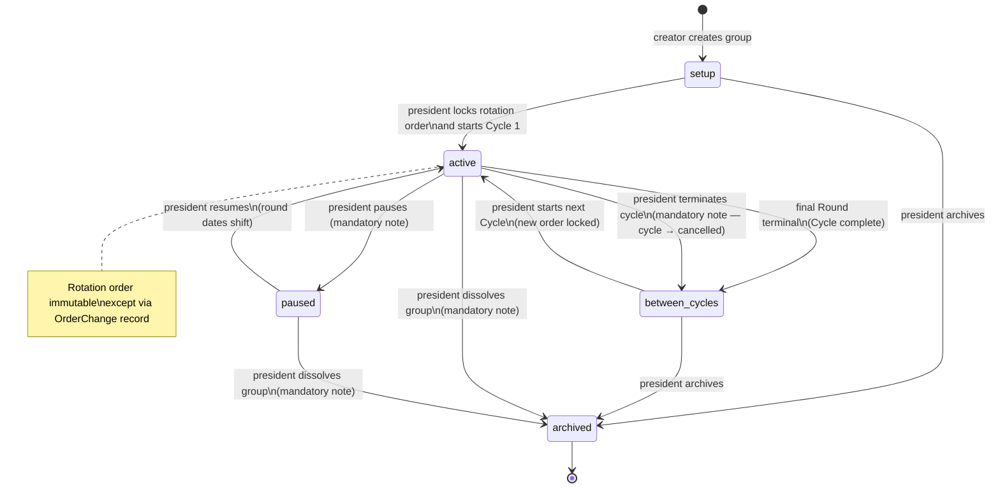
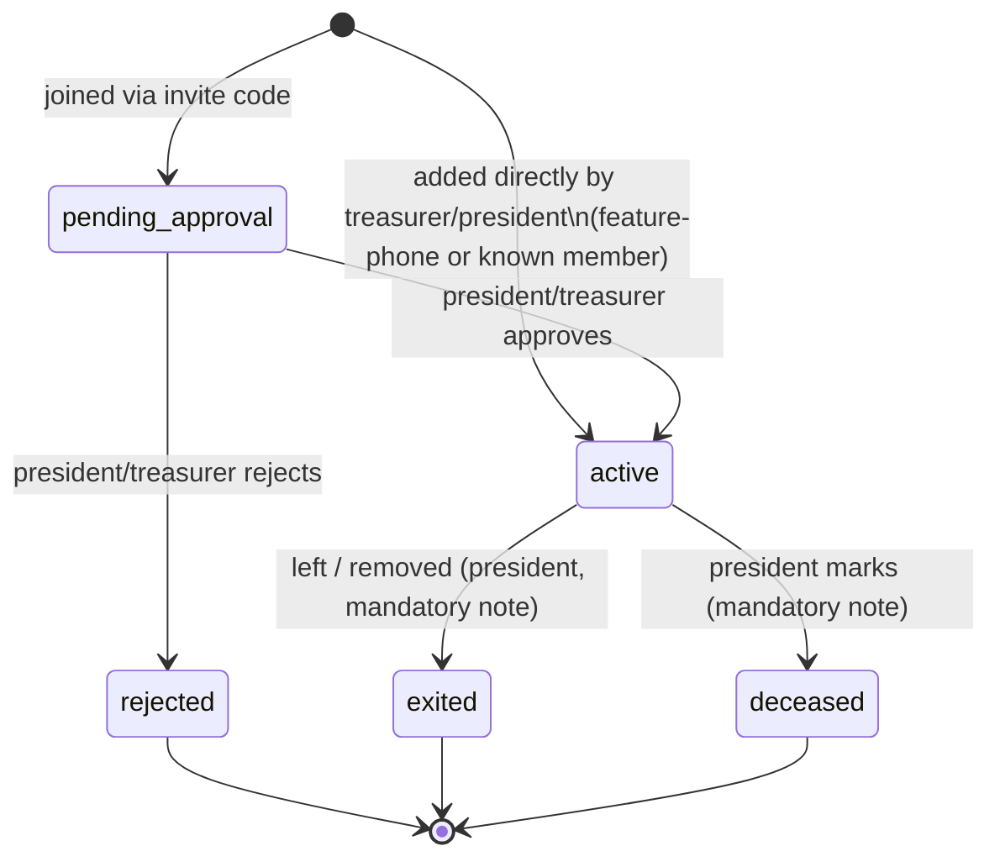
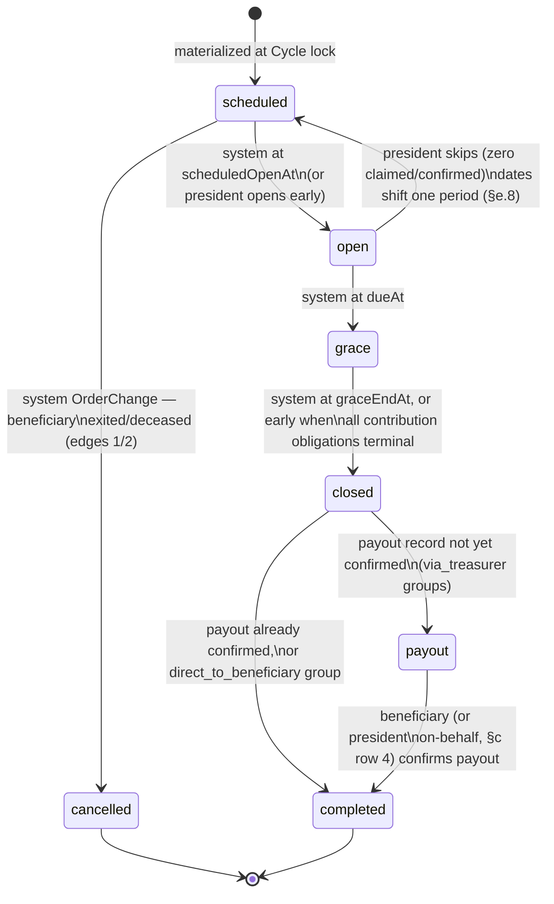

# Lifecycle & State Machines

All timestamps are ms epoch (`At` suffix). All states are Convex named validators (`v.union(v.literal(...))`), exported as module-level consts from `convex/schema.ts` (e.g. `groupStatusValidator`, `roundStatusValidator`, `paymentStateValidator` — 01's actual export name, which 05 Week 1 must also use — `membershipStatusValidator`). Every state transition on every entity is appended to an immutable `transitions` log table (`entityTable`, `entityId`, `fromState`, `toState`, `actorMembershipId | 'system'`, `note`, `createdAt`) — **no transition ever overwrites history**. The app never moves money; every transition below changes ledger state only.

> **Pilot note — SMS is L6/premium, not in the pilot (05).** Every SMS mentioned in this document ships post-pilot. During the pilot, feature-phone members' notice channel is the group feed (read aloud at the réunion) plus the treasurer/président contact line in the receipt copy; payee-side auto-confirm (`T_AUTO_CONFIRM`) proceeds **without** an SMS receipt — a consciously accepted gap, not an oversight. (The tension between L6 and locked decision 7's "treasurer logs for them + SMS receipt" is flagged for the resumed review pass; that call belongs in 00/05, not here.)

## Global timer constants

DECISION: fixed app-wide in MVP (not group-configurable), defined in `convex/lib/timers.ts`, evaluated by a single cron in `convex/crons.ts` running every 15 minutes. (01 alignment: delete `confirmationWindowDays` from the schema — confirmation timing is these fixed constants; `GRACE_DAYS` stays per-group, mapping to 01's `onTimeGraceDays`.)

| Constant | Value | Meaning |
|---|---|---|
| `T_CONFIRM_REMIND_1` | 24h | First reminder to confirming party after claim |
| `T_CONFIRM_REMIND_2` | 48h | Second reminder |
| `T_AUTO_DISPUTE` | 72h | Payer-logged claim unconfirmed by payee → auto-disputed. **Anchored to the réunion**: fires at `max(claimedAt + T_AUTO_DISPUTE, dueAt)` — never before the due date (§c) |
| `T_AUTO_DISPUTE_PAYOUT` | 7d | Same mechanism for `payout`-kind records (05 Week 2 DECISION: payout reconciliation is slower than contribution confirmation) |
| `T_AUTO_CONFIRM` | 48h | Payee-logged claim (Meeting Mode) with silent payer → auto-confirmed |
| `T_DISPUTE_STALE` | 7d | Open dispute unresolved → escalation reminder to president (repeats weekly) |
| `T_PAYOUT_STALE` | 7d | Payout record still `pending` (never claimed) 7 days after round close (`via_treasurer` groups) → group-visible feed alert + push to president + prompt to beneficiary « Avez-vous reçu votre versement ? » (repeats weekly). This is the anti-abscond timer 04 §C's "treasurer absconds" mitigation relies on: a treasurer who simply never claims the payout must become visible fast, not sit silent forever |
| `GRACE_DAYS` | 2d default, president-configurable 0–7 per group | Round grace period after due date |

---

## (a) Group lifecycle

### States

| State | Meaning | Allowed operations |
|---|---|---|
| `setup` | Group created. Invites open, members joining, rotation order being drafted, schedule/amount/collection mode being set. | Invite, approve members (≤ 40 cap), add feature-phone members, edit order/amount/schedule/collection mode freely. No PaymentRecords exist. |
| `active` | Cycle in progress. Order, amount, schedule, collection mode **locked**. | Rounds run; payments logged; fines (manual, §f); disputes; member exits (see edge cases); réunion moves/skips (§e.8); terminate cycle; dissolve. Order changes only via OrderChange record (system removal only in MVP — see Rotation order). |
| `paused` | Holidays / crisis. No NEW rounds open; round timers frozen. **Record-level timers (`T_AUTO_DISPUTE`, `T_AUTO_CONFIRM`) keep running** — money already claimed must still be acknowledged. | Confirmations, disputes, dispute resolution, **and claims on already-open rounds and on arrears records** — real groups pause for fêtes/crises but members keep paying arrears and late contributions (often exactly when remittance money arrives); refusing claims would push that money off-ledger. Only opening new rounds is frozen. |
| `between_cycles` | Cycle complete (or terminated). Reliability scores updated. Arrears records remain open and payable. | Add/remove members, re-order, change amount/schedule/collection mode, start next cycle, archive. |
| `archived` | Terminal. Read-only forever — ledger, history, and scores remain visible to all former members. Reached via archive or dissolution. | Read + export only. |

### Group creation
Creator picks group name, schedule (`weekly | biweekly | monthly`), fixed contribution amount (XAF), meeting day/time, collection mode, fine settings (see §f).

- DECISION: **collection mode**, per group: `via_treasurer` (default) `| direct_to_beneficiary`. Many real njangis — especially MoMo-based rotating ones — hand/send the contribution **directly to the round's beneficiary**; forcing member→treasurer→beneficiary would mean a double MoMo hop with real transfer/cashout fees, and groups paying direct would make the ledger unable to represent the truth (the record's payee would not be the actual payee). In `direct_to_beneficiary` mode, contribution records' payee is the round's beneficiary and no payout record exists (§b). Editable only in `setup`/`between_cycles`.
- DECISION: creation asks the creator's **actual role** — président or trésorier (locked decision 5: the champion/buyer is often the treasurer; auto-crowning a treasurer-champion "président" would strip the real, often older, president of authority and misattribute every override badge). The creator's Membership gets the role they pick. During `setup` the creator administers the group regardless of role; the `president` role must be assigned before cycle lock (lock guard) and is transferable to any active `hasAccount: true` Membership (transfer posts a feed entry). Override badges always name the actual president.
- President assigns role `treasurer` to any active Membership (may be themself in small groups; DECISION: allowed but UI warns that president-override on own records is visible to all).

### Invites — designed for WhatsApp
- Each group has one **group invite code**: 6 chars, uppercase, alphabet `ABCDEFGHJKLMNPQRSTUVWXYZ23456789` (no 0/O/1/I), e.g. `K7PMQ4`. Stored on `groups`, regenerable (regeneration invalidates the old code). The code **stays valid during active cycles** — people are recruited at réunions year-round, and for a monthly 25-member group closing enrollment would mean two years; mid-cycle joins land in `pending_approval` and the "Prochain cycle" list per edge case 4.
- Invite link `https://<domain>/j/K7PMQ4` resolves to a public landing page (prerendered shell) showing group name, member count, contribution amount, schedule — then Clerk phone-number sign-up.
- Share action opens WhatsApp with prefilled French copy (i18n key `invite.whatsappMessage`):
  *« {presidentName} t'invite à rejoindre le njangi "{groupName}" — {amount} FCFA / {schedule}. Rejoins ici : {link} (code {code}) »*
- DECISION: joining via code creates Membership in `pending_approval`; **president or treasurer must approve** before the member is `active` (njangis are closed trust circles; an open link must not auto-admit). Approval/rejection sends push to the joiner. Approval is rejected above **40 active+pending memberships** (hard cap, 05 Week 6 DECISION).
- Feature-phone members: treasurer/president adds them directly (name + phone number) → Membership `active` with `hasAccount: false`. Direct add is rejected above the same 40-membership cap. If that phone number later signs up via Clerk, the account is linked to the existing Membership and its full history (match on E.164 phone, `convex/utils/phone.ts`).

### Membership states

`exited` and `deceased` are terminal but **never deleted**: their PaymentRecords, arrears, and ReliabilityScore history remain in the ledger permanently (decision 6 — immutability is the product).

### Rotation order
- During `setup` / `between_cycles`: president drags members into order manually. No algorithmic ordering in MVP.
- DECISION: **multiple hands supported** (« deux mains » / « deux noms » — one person holding 2+ positions, contributing 2× and receiving 2 rounds — routine in real njangis and certain to surface during pilot recruitment). A membership may appear N times in the rotation order: N rounds as beneficiary, and its per-round contribution obligation is the fixed amount × N (the pre-created record's amount is adjusted, §b).
- **Cycle start = lock**: president taps "Démarrer le cycle". Guards: 2 ≤ active members ≤ 40, order contains every active member **at least once** (multi-hand allowed), amount > 0, schedule set, treasurer assigned, president assigned. On lock the system materializes the whole Cycle: one Round per rotation position (a multi-hand member gets one Round per hand), in order, with `scheduledOpenAt` / `dueAt` / `graceEndAt` computed from the schedule. Order becomes immutable and is shown to every member (public within group).
- Post-lock order changes only via **OrderChange record** (immutable, mandatory note, visible to all members). DECISION — MVP supports exactly one kind: **system removal** of an exited/deceased member's future round(s) (round → `cancelled`, edges 1/2; 01's invariant I-4 is amended to "the effective beneficiary order lives on rounds, mutable only via an immutable OrderChange/transitions entry"). **LATER (post-MVP, matching 05 M3):** swapping two future beneficiaries (the "begging the turn" practice) — not in MVP. Completed/open rounds are never re-ordered.

### Cycle completion
When the final Round reaches a terminal state (`completed`, or `cancelled` for removed positions), the Cycle transitions to complete and the group to `between_cycles`. System posts a cycle summary to the group feed (totals collected, fines, on-time rate per member, disputes count) with a WhatsApp-shareable image/text export. ReliabilityScores updated. President chooses: start next Cycle (members carried over minus `exited`/`deceased`, plus newly approved members; order re-set; amount/schedule editable) or archive.

### Terminating a cycle mid-cycle
DECISION: president-only **« Terminer le cycle »**, mandatory note — for a group that locked a wrong setup (wrong amount discovered after lock) or collapses after a default crisis. Effects: all `pending` records bulk-cancelled (§c row 13); `claimed`/`disputed` records are **not** cancelled — money allegedly moved must still be accounted, so they resolve via the normal handshake/override; arrears records stay open and payable. The Cycle's terminal status is `cancelled` (01's existing cycle validator), the group moves to `between_cycles`, and a summary with the note is posted to the feed. From `between_cycles` the president can re-set up and start a fresh cycle, or archive.

### Dissolving a group
DECISION: president-only **« Dissoudre le groupe »** (`active` | `paused` → `archived`, mandatory note) — a group that implodes after a default crisis (edge case 3, the most likely real-world failure) must not become a permanent zombie, and the "immutable record forever" promise must be able to record the dissolution itself. Effects: `pending` records bulk-cancelled (§c row 13); arrears records kept **open-but-frozen** (visible and exportable, timers off); in-flight `claimed`/`disputed` records are listed in the dissolution summary and may be resolved beforehand via the president on-behalf/override path; appropriate score events emitted; a final dissolution summary (with the note) posted to the feed. Everything remains readable/exportable forever per `archived`.

---

## (b) Round lifecycle

DECISION: **skip is a date shift, not a state.** A skipped `scheduled` round keeps state `scheduled` with shifted dates; a skipped `open` round returns to `scheduled` (§e.8). The terminal `cancelled` state exists only for exited/deceased members' future rounds — never for skips.

### Opening rules
- `scheduled → open` fires automatically at `scheduledOpenAt` (cron). DECISION: `scheduledOpenAt` = start of the period (e.g. for monthly with meeting on the 28th, the round opens on the 1st so members can pay any time during the month); `dueAt` = meeting date/time; `graceEndAt = dueAt + GRACE_DAYS`. President may open early.
- **On open, the system creates the round's PaymentRecords in `pending`**:
  - One `contribution` record per active member **excluding `joinedMidCycle: true` members** (they owe nothing this cycle — edge case 4; this guard is what keeps round-open from billing them). Amount = group fixed amount × hands held (§a). Payee = current treasurer's Membership (`via_treasurer`) or the round's beneficiary (`direct_to_beneficiary`).
  - In `via_treasurer` groups only: one `payout` record (payer = treasurer, payee = the round's beneficiary, **amount unset**). DECISION (per 05 M8): the payout amount is **entered by the treasurer at claim time** — the app records reality and never computes or asserts an owed amount (safer under R4/R7, and shortfall rounds make any computed figure wrong by construction). The claim screen may show the sum of confirmed contributions **labeled as an estimate**, never stored as the obligation. The claim mutation requires a treasurer-entered amount > 0. (01 §3.1 `paymentRecords` must state this explicitly: payout records carry treasurer-entered amounts and are exempt from any expected-amount math.) In `direct_to_beneficiary` groups no payout record exists.
  - Records whose payer and payee resolve to the same membership (treasurer's own contribution; the beneficiary's own contribution in direct mode; the treasurer's own beneficiary round) follow the **self-record rule** (§c).
- This pre-creation is what powers the Meeting Mode roll-call list.
- Notifications on open: push to all members "Round {n} ouvert — {amount} FCFA pour {beneficiaryName}, échéance {date}" + USSD how-to-pay shortcut. SMS to feature-phone members: **L6/premium, post-pilot** (pilot channel: group feed + réunion announcement, see pilot note).

### During `open` and `grace`
- Contributions accepted via the PaymentRecord handshake (§c) — member self-log, or payee-side Meeting Mode roll-call at the réunion.
- Reminder pushes: 48h before `dueAt`, at `dueAt`, and daily during grace to members whose contribution record is still `pending`.
- The **payout handshake runs in parallel from `open` onward** (`via_treasurer` groups): real njangis hand the beneficiary the money at the meeting; the app must not force a 2-day wait. Treasurer can claim the payout any time after `open`.
- **Moving the réunion**: president may shift `dueAt`/`graceEndAt` on a `scheduled` or `open` round by up to one schedule period (§e.8). All timeliness evaluation uses the moved `dueAt`.

### Closing rules (`grace → closed`, system-driven, no human gate)
At `graceEndAt` (or earlier if every contribution record is already terminal), the system force-closes:
1. Each member's **obligation status** is computed on the round from records **claimed** by close, measured by `claimedAt` (DECISION: timeliness = when the money was handed over, not `confirmedAt` — confirmation may lag for innocent reasons): `on_time` (claims with `claimedAt ≤ dueAt` covering amount × hands), `late` (covered, some claim after `dueAt`), `partial` (claimed sum > 0 but short), `unpaid` (zero), `disputed` (any record in dispute). DECISION — **one rule, no freeze contradiction: the status is provisional while any of the member's records is still in-flight (`claimed`/`disputed`)**. A later `confirmed` keeps the provisional status — the record counts with its original `claimedAt`, matching §d (a member who claimed on time but whose treasurer hadn't confirmed by close is never marked down for it). A later cancellation or dispute-cancellation downgrades the status and retro-adjusts the emitted score event. Records first claimed **after** close can never improve the status. The status finalizes when the member's last in-flight record reaches a terminal state. Summaries mark still-provisional statuses « à confirmer ».
2. **Stragglers**: `pending` contribution records of `partial`/`unpaid` members are NOT cancelled — they are flagged `isArrears: true` and remain open indefinitely. They can be claimed and confirmed weeks later; confirmation clears the arrears badge but never improves the finalized obligation status (or its score effect).
3. `claimed` records keep their own (anchored) `T_AUTO_DISPUTE` / `T_AUTO_CONFIRM` timers; the round does not wait for them.
4. **No automatic fine generation in MVP** — fines are logged manually by the treasurer/president (§f, per 05 M14 and 01's DECISION). (LATER: the auto-proposal pipeline, §f, generates proposals from finalized — never provisional — statuses.)
5. Round summary posted to group feed + WhatsApp-shareable text: who paid, who's late, who's owing, total collected, payout status.

### `closed → payout → completed`
- `direct_to_beneficiary` groups: `closed → completed` immediately (no payout record — contributions went straight to the beneficiary).
- `closed` with payout record already `confirmed` → `completed` immediately.
- Otherwise the round sits in `payout` until the payout record is confirmed by the beneficiary — or **by the president on the beneficiary's behalf** when the beneficiary is `hasAccount: false`, `exited`, or `deceased` (§c row 4): a routine cash handover publicly witnessed at the réunion must never route through a dispute label. The handshake is §c, including the anchored auto-dispute (`T_AUTO_DISPUTE_PAYOUT`) if the treasurer claimed and an app-holding beneficiary stays silent.
- If the treasurer **never claims** the payout, `T_PAYOUT_STALE` escalates: group-visible feed alert + push to president + prompt to the beneficiary « Avez-vous reçu votre versement ? », repeating weekly. (This is the mechanism 04 §C's "treasurer absconds" mitigation must reference — there is no pending→disputed auto-flag.)
- Round `completed` does **not** require arrears cleared or disputes resolved — those live on the records and the group dashboard ("Impayés: 2 — 10 000 FCFA") so the rotation never deadlocks on one straggler.

---

## (c) PaymentRecord state machine

One machine for all five kinds (`contribution | payout | fine | assistance | disbursement`). Roles per kind:

| kind | payer | payee |
|---|---|---|
| contribution | member | treasurer (`via_treasurer`) / round beneficiary (`direct_to_beneficiary`) |
| payout | treasurer | beneficiary member — `via_treasurer` groups only |
| fine | fined member | treasurer |
| assistance | member | treasurer |
| disbursement | treasurer | recipient membership (refunds, family settlements, assistance hand-overs — round-independent; 01: reconcile invariant I-5 so `roundId` is required for `payout` only) |

Method: `momo_mtn | orange_money | cash`. Proof: optional MoMo/OM transaction ID (UI nudges for it on mobile-money claims), optional screenshot upload (stored, shown in disputes, **never trusted as truth**). Cash claims require no artifact. **Truth = payee confirmation, always.**

The claim carries `claimedBySide: 'payer' | 'payee'`:
- **Payer-side claim** (member self-logs "j'ai envoyé"): payee must confirm. Silence → auto-dispute at the anchored timer (payee never acknowledged receiving money — that is exactly the case the ledger must surface).
- **Payee-side claim** (Meeting Mode: treasurer logs cash received — or, in `direct_to_beneficiary` groups, the round's beneficiary runs the roll-call; or beneficiary logs payout received): the payee has already attested receipt — the strong side of the truth rule is satisfied. The payer gets a confirmation request as an objection window; **silence → auto-confirm at `T_AUTO_CONFIRM`**. This is what makes Meeting Mode's "20 entries in 2 minutes" safe without 20 manual confirmations, including for feature-phone members (SMS receipt « Reçu {amount} FCFA pour {groupName}, round {n}. Si erreur, contactez {presidentPhone}. » — **L6, see pilot note**; in the pilot the public feed is their receipt).

DECISION — **anchored auto-dispute**: `T_AUTO_DISPUTE` fires at `max(claimedAt + T_AUTO_DISPUTE, dueAt)` (payout kind: `T_AUTO_DISPUTE_PAYOUT`), never before the réunion. Rounds open at the start of the period precisely so members pay early, while treasurers culturally reconcile at the réunion — early MoMo self-logs must not generate false alarms against the treasurer (a public « litige » against the treasurer reads as an embezzlement accusation). Auto-disputes escalate **privately**: push to payer, payee, president, and treasurer with neutral copy (« Paiement non confirmé — à vérifier »), **no group-feed broadcast**. The word « litige » and the feed entry are reserved for human-initiated contests (row 6) and for `T_DISPUTE_STALE` escalation.

DECISION — **self-records (payer = payee)**: the treasurer is also a contributing member, so every `via_treasurer` round contains one record where one person is both sides (and once per cycle the payout is treasurer→self; in direct mode, the beneficiary's own contribution is the same case). A two-sided handshake is meaningless with one party: when the holder claims a self-record it transitions directly `pending → confirmed`, feed-labeled « auto — même personne »; no confirm-reminder, auto-confirm, or auto-dispute timers ever start, and self-records are excluded from the pilot entry-metric denominator (05).

```mermaid
stateDiagram-v2
    [*] --> pending : system creates obligation\n(round open / fine logged / levy launched)
    pending --> claimed : payer logs "sent" OR\npayee logs "received" (Meeting Mode)
    pending --> confirmed : self-record claim (payer = payee)\n« auto — même personne »
    pending --> cancelled : system/president cancels obligation\n(skip, exit, cancelled round, dissolution)
    claimed --> confirmed : counterparty (or president on-behalf)\nconfirms, OR auto-confirm at T_AUTO_CONFIRM\n(payee-side claims only)
    claimed --> disputed : counterparty (or president on-behalf)\nrejects, OR anchored auto-flag\n(payer-side claims only)
    claimed --> cancelled : claimant withdraws own claim\n(obligation re-created as new pending record)
    disputed --> confirmed : payee late-confirms OR\npresident override (mandatory note)
    disputed --> cancelled : payer withdraws claim OR\npresident override (mandatory note)
    confirmed --> [*] : ledger-final — never mutated;\ncorrections via amendment records (row 12)
    cancelled --> [*]
```

`confirmed` is **ledger-final and never mutated**: it counts toward obligations, balances, summaries, and ReliabilityScore. There is **no state-mutating exit from `confirmed`** — corrections are NEW amendment records (`amendmentKind: 'override_reversal'`, row 12) per 01 §3.4, leaving the original row untouched, with the override itself documented by an immutable `presidentOverrides` row. `cancelled` records stay visible in the record's history detail but drop out of balances; cancelling a `claimed`/`disputed` record on an unmet obligation causes the system to re-create a fresh `pending` record so the obligation is never silently lost (idempotent: skip if obligation already satisfied or membership terminal).

### Full transition table

| # | From → To | Trigger | Allowed actor | Guards | Timer | Notifications fired |
|---|---|---|---|---|---|---|
| 1 | (create) → `pending` | Round opens / fine logged / assistance levy launched / disbursement created / shortfall split (rows 2–3) / cancellation re-creation | system (treasurer/president action for fine/assistance/disbursement) | Standard round-open path: round `open`, membership `active`, not `joinedMidCycle`. **Exemption:** system arrears materialization (edge 3) may create `pending` records against `scheduled` rounds and terminal memberships (records carry `isArrears: true` and the exited `membershipId`) | — | Covered by round-open / fine / levy notifications |
| 2 | `pending → claimed` | Payer logs payment (amount, method, optional txn ID/screenshot, `claimedAt` defaults now) | payer | record `pending`; amount > 0; payer ≠ payee (self-records: see DECISION above); warn (not block) if obligation already satisfied — double-payment guard. **If amount < outstanding obligation, system immediately re-creates a `pending` record for the shortfall** (same idempotency guard as cancellation re-creation; enables mid-round top-ups, §e7) | starts `T_CONFIRM_REMIND_1/2` + anchored `T_AUTO_DISPUTE` (`max(claimedAt + T, dueAt)`; payouts: `T_AUTO_DISPUTE_PAYOUT`) | Push to payee: "{payer} déclare avoir payé {amount} — confirmez". Feed entry "déclaré". |
| 3 | `pending → claimed` (payee-side) | Payee logs receipt — Meeting Mode tick or beneficiary "j'ai reçu" | payee (treasurer for fines/assistance and `via_treasurer` contributions; round beneficiary for direct-mode contributions and payouts) | same as 2 (incl. shortfall split) | starts `T_AUTO_CONFIRM` | Push to payer: "Le trésorier a enregistré {amount} reçu de vous — confirmez ou signalez". SMS receipt to feature-phone payers (**L6** — pilot: feed is the receipt). |
| 4 | `claimed → confirmed` | Counterparty taps confirm | the side that did NOT claim; **or president acting on behalf of a counterparty (payer OR payee) whose membership is `hasAccount: false`, `exited`, or `deceased`** — never the record's other party (no self-confirmation; the paying treasurer can never confirm their own payout claim) | actor is counterparty or qualifying president-on-behalf; on-behalf requires **mandatory note** and is stored with `recordedByMembershipId` on the confirmation (01 must add this field to `confirmations` — it exists on `paymentRecords` only) | clears timers | Push to both: "Confirmé ✓ {amount}". Feed entry; on-behalf confirms feed-labeled « attesté par le président pour {name} ». SMS receipt to feature-phone party (**L6**; mirrors Meeting Mode copy « Si erreur, contactez {presidentPhone} »). If obligation newly satisfied: "Round {n}: à jour". |
| 5 | `claimed → confirmed` (auto) | `T_AUTO_CONFIRM` elapses, payer silent | system | `claimedBySide = 'payee'` only | `T_AUTO_CONFIRM` | Push/SMS to payer: "confirmé automatiquement" (SMS **L6** — pilot proceeds without it, see pilot note). Feed entry marked "auto". |
| 6 | `claimed → disputed` | Counterparty contests — primary entry point **« Je n'ai pas reçu »** (concrete verb, not legalistic), with mandatory reason (`not_received`, `wrong_amount`, `other` + free text) | the side that did NOT claim; **or president on behalf of a `hasAccount:false`/`exited`/`deceased` counterparty** (symmetric on-behalf objection right — the objection window must not be fictional for feature-phone payers) | — | clears auto-timers, starts `T_DISPUTE_STALE` | Push to payer, payee, president, treasurer: "Litige ouvert sur {amount} — round {n}". Feed entry. (Human contests keep the litige framing.) |
| 7 | `claimed → disputed` (auto) | Anchored timer elapses (`max(claimedAt + T_AUTO_DISPUTE, dueAt)`; payouts: `T_AUTO_DISPUTE_PAYOUT`), payee silent | system | `claimedBySide = 'payer'` only | anchored `T_AUTO_DISPUTE` | **Private escalation only**: push to payer, payee, president, treasurer — neutral copy « Paiement non confirmé après {n} jours — à vérifier » ({n} interpolated from the constant, never hardcoded). **No group-feed broadcast**; « litige » framing reserved per the anchored-auto-dispute DECISION. |
| 8 | `claimed → cancelled` | Claimant withdraws own claim ("Je me suis trompé") | claimant only | record not yet confirmed | clears timers | Push to counterparty + feed. System re-creates `pending` if obligation unmet. |
| 9 | `disputed → confirmed` | Payee late-confirms ("finalement reçu") | payee | — | — | Push to all parties + president: "Litige résolu — confirmé". Feed update. |
| 10 | `disputed → cancelled` | Payer withdraws claim | payer | — | — | Push to all parties + president: "Litige résolu — déclaration retirée". New `pending` re-created if obligation unmet. |
| 11 | `disputed → confirmed` / `disputed → cancelled` | **President override**, mandatory note, picks outcome | president only | president not a party? **No** — president may be a party (small groups); override always allowed but UI badges "résolu par le président (partie au litige)" | — | Push to all parties + group feed: outcome + note excerpt. Immutable override record created. |
| 12 | `confirmed` — **no state change** (amendment) | **President override reversal** (duplicate, wrong member, fat-finger): creates a NEW amendment PaymentRecord (`amendmentKind: 'override_reversal'`) that reverses the confirmed row's ledger effect — the original confirmed row is never patched (01 §3.4) | president only | mandatory note; no counterparty handshake required; immutable `presidentOverrides` row created; both parties notified | — | Push to both parties + feed: "Paiement annulé par le président — {note}". Amendment + override records immutable. |
| 13 | `pending → cancelled` | Obligation void: round skip re-creation, round `cancelled` (exited/deceased beneficiary), membership exits/deceased, fine waived, levy closed, cycle terminated, group dissolved | system, or president (mandatory note) | record `pending` | — | Feed entry only (no individual pushes for bulk system cancels). |
| 14 | reminder (no transition) | `T_CONFIRM_REMIND_1` then `T_CONFIRM_REMIND_2` | system | record `claimed`; never for self-records | 24h / 48h | Push to confirming party: "Rappel: confirmez {amount} de {name}". |
| 15 | escalation (no transition) | `T_PAYOUT_STALE`: payout record still `pending` 7 days after round close | system | `via_treasurer` groups; kind `payout` | 7d, repeats weekly | Group-visible feed alert + push to president + prompt to beneficiary « Avez-vous reçu votre versement ? ». The anti-abscond timer (04 §C). |

Mutation guards follow piol-vite conventions: every transition mutation is idempotent (re-tapping confirm on a `confirmed` record returns current state, no error), checks role via Membership, throws for unauthenticated, declares full `args`/`returns` validators.

---

## (d) Dispute flow

**Visibility — DECISION: full transparency inside the group.** Every active member of the Group sees the disputed record: parties, amount, method, claim time, dispute reason, and proof artifacts (txn ID / screenshot). This is deliberate (decision 6: who-paid-who-when visible to all is the wedge) and mirrors how disputes are aired at the réunion anyway. Nothing is visible outside the group. Screenshots are displayed with a permanent caption: "Capture fournie par {name} — ne vaut pas confirmation." MVP dispute artifacts = the dispute's reason, the record's existing proof fields, and the resolution note (all already in 01's schema); the running comment/evidence thread is **L1 post-MVP** (05) — the pilot escalation path is the WhatsApp deep link (03 B7).

**Who can act:**

| Action | Actor | Effect |
|---|---|---|
| Late-confirm ("J'ai bien reçu finalement") | payee | `disputed → confirmed`. No score penalty for payer; payee gets no penalty either (MVP keeps payee-side incentives soft). |
| Withdraw claim ("Je retire ma déclaration") | payer | `disputed → cancelled`; fresh `pending` re-created if obligation unmet. |
| Add comment / attach proof | payer, payee, treasurer, president | **L1 post-MVP** (no comments table in 01; 05 defers evidence threads). MVP: dispute reason + record proof fields + resolution note only. |
| **President override** | president only | For `disputed` records: chooses `confirmed` or `cancelled`. **Mandatory note** (min 10 chars, UI enforces). Creates an immutable `presidentOverrides` row (`paymentRecordId`, `outcome`, `note`, `createdAt`, `presidentMembershipId`) — the override is itself a ledger artifact, listed in group history and exports, never editable or deletable. (For `confirmed` records, the override takes the amendment form — §c row 12 — never a state mutation.) |

**Timers:** at `T_DISPUTE_STALE` (7 days) the president gets a push: "Litige non résolu depuis 7 jours — tranchez ou relancez", repeated weekly. Disputes never auto-resolve; only humans close them.

**ReliabilityScore effects** (events emitted on resolution; scoring formula specified in the Reliability section, but the events are fixed here):

| Resolution | Score event |
|---|---|
| Payee late-confirms | `dispute_resolved_neutral` — no penalty to either side; the contribution counts with its original `claimedAt` for timeliness (consistent with the provisional-status rule, §b closing rule 1). |
| Payer withdraws | `false_claim_withdrawn` — penalty to payer (claiming unsent money is the behavior the score must punish). |
| Override → confirmed | `dispute_overridden_for_payer` — no payer penalty; **no payee penalty in MVP** (avoid punishing slow confirmers into never confirming). |
| Override → cancelled | `false_claim_overridden` — heavier payer penalty than voluntary withdrawal. |
| Auto-dispute fired (event 7) | No score effect by itself — it is a flag, not a verdict. |

---

## (e) Edge cases — explicit handling

**1. Member defaults mid-cycle (has NOT yet received).**
Unpaid at round close → obligation `unpaid` (provisional rules, §b), arrears record stays open, fine may be logged manually (§f), score event `round_unpaid`. After **2 consecutive** unpaid rounds (DECISION) the Membership is badged `defaulting` on every group screen and the president is prompted to act: (a) keep them (arrears accumulate), or (b) remove them — Membership → `exited` with mandatory note; their future beneficiary Round(s) transition to `cancelled` via a system OrderChange entry (§a; one per hand held); remaining rounds shift earlier; their open `pending` records cancelled; arrears records on money already owed **stay open** and remain payable; their confirmed contribution history stays in the ledger forever. Any cash refund of what they already contributed is a group decision made offline; if money moves, treasurer records it as a **`disbursement`** record (round-independent, standard handshake, mandatory note) so cash-on-hand decrements truthfully.

**2. Member leaves voluntarily / dies mid-cycle.**
President sets Membership → `exited` or `deceased`, mandatory note. Same mechanical consequences as removal above. For `deceased` who had not yet received, president picks one of two recorded outcomes (DECISION — MVP supports exactly these): (a) **remove the position(s)** (as above; the group settles with the family offline, recordable as a `disbursement` record with note), or (b) **keep the round**: the deceased's Round runs normally; the treasurer claims the payout and the president confirms it **on the family's behalf via the on-behalf confirm (§c row 4, mandatory note naming the recipient)** — no auto-dispute detour, no override needed. No "heir Membership" object in MVP.

**3. Beneficiary already received, then defaults.**
The nightmare case the ledger exists for. App cannot recover money — it makes the debt undeniable and portable: arrears records accumulate each round; group dashboard shows "{name} doit {total} FCFA (a déjà reçu sa cotisation)"; score event `post_payout_default` (the heaviest penalty — weighted above ordinary unpaid rounds); if removed, the unpaid obligations for all *remaining* rounds of the cycle are materialized immediately as open arrears records (DECISION; see the row-1 guard exemption — these records target `scheduled` rounds and a terminal membership) so the total debt is a single visible number. Settlement happens offline; repayments are logged as ordinary contribution records against the arrears; write-off only via president override with note. The defaulter's portable ReliabilityScore carries this to any future group that looks them up.

**4. New member joins mid-cycle.**
**Beneficiary slots: not until next cycle** (DECISION, MVP). The invite code **stays valid during active cycles** (people are recruited at réunions year-round; for a monthly 25-member group, closed enrollment would mean two years): joins are accepted into `pending_approval`, and approvals (subject to the 40-membership cap) create `active` Memberships flagged `joinedMidCycle: true` — they receive no rounds, owe no contributions, are **excluded from round-open pre-creation** (§b guard), and appear in a "Prochain cycle" list. They are included automatically when the next cycle's order is drafted. (Real njangis sometimes admit mid-cycle with buy-in; explicitly deferred post-MVP.)

**5. Treasurer replaced mid-cycle.**
President reassigns the `treasurer` role (one treasurer per group, MVP). System then: re-points `payeeMembershipId` of **`pending` records only** to the new treasurer. **`claimed` and `disputed` records keep the old treasurer as payee** — they assert money already handed to the old treasurer, who must still confirm or resolve what they allegedly received; the new treasurer cannot truthfully confirm cash they never held (truth = payee confirmation), and must never inherit a predecessor's dispute. If the old treasurer is fully gone (exited/unreachable), the president resolves their leftover records via the on-behalf confirm / override path (§c rows 4, 6, 11). **Confirmed records keep the historical treasurer** (the ledger says who actually received the cash). System posts a feed entry and shows both treasurers a **handover statement** — ledger cash-on-hand = confirmed contributions + fines + assistance − confirmed payouts − confirmed disbursements — to check against the physical handover. DECISION (custody framing, non-negotiable copy): wherever this figure appears (handover screen, exports) it is titled **« Espèces chez le trésorier (selon le registre) — l'application ne détient aucun fonds »** — never an unattributed « Solde en caisse » (04: add unattributed 'solde'/'caisse' phrasing to the CI copy-scan list). The physical cash transfer itself is offline; DECISION: not modeled as a PaymentRecord in MVP (it is intra-role, not member↔group). In `direct_to_beneficiary` groups the statement covers fines/assistance only.

**6. Double payment.**
Prevention first: claiming against an already-satisfied obligation triggers a blocking-style warning (skippable — sometimes legitimate, e.g. paying for a sibling is *not* supported, paying arrears is); the confirm screen shows the payee "⚠ Ce membre est déjà à jour pour ce round" before they confirm. If a duplicate still gets confirmed: obligation shows `overpaid` badge with the excess amount; resolution is offline refund + president override-reversal amendment of the duplicate (§c row 12; note: "doublon remboursé en espèces le {date}"), or the group leaves it standing as goodwill. **No carry-forward credit ledger in MVP** (DECISION).

**7. Wrong amount (partial / over).**
Claim amount is prefilled with the outstanding obligation but editable (reality: people send what they have). Multiple PaymentRecords per (member, round) are normal; the obligation is satisfied when the **sum of confirmed records ≥ fixed amount × hands held**. DECISION — **the shortfall split happens at claim time, not at close** (§c row 2): a claim below the outstanding obligation immediately re-creates a `pending` record for exactly the shortfall (same idempotency guard as cancellation re-creation), so a member who sends 5,000 of 10,000 on day 2 can log the remaining 5,000 the same week. Round close (rule 2) only flags whatever `pending` remains. Confirmed sum still short at close → `partial` (provisional rules apply); above → `overpaid` badge, handled as in #6 — no credit toward next round (DECISION, MVP). `wrong_amount` is also a first-class dispute reason: payee disputes the claim, payer re-claims correct amount or president resolves.

**8. Réunion moved / round skipped / group pauses.**
- **Move the réunion** (DECISION): real meetings shift constantly (deuils, fêtes, travel) — a 5-day postponement must not mark every member « late ». President-only **« déplacer la réunion »** on a `scheduled` or `open` round: edits `dueAt` (and `graceEndAt`) by up to one schedule period, mandatory note, feed entry + push to all members. `on_time`, reminders, anchored auto-dispute, and 05's metric 1 all evaluate against the **moved** `dueAt`. Later rounds unaffected.
- **Skip one round = a date shift, not a state** (e.g. fête season): president skips a `scheduled` round (its dates and all later rounds' dates shift one schedule period; immutable shift note; state stays `scheduled`), or an `open` round **only if it has zero claimed/confirmed records** (otherwise it must run to close — money already moved must be accounted): the round returns to `scheduled` with shifted dates and its `pending` records are cancelled and re-created when it re-opens (idempotent). Mandatory note. The round's beneficiary is NOT skipped over; rotation order unchanged; the skipped period simply has no réunion. Feed + push to all: "Round du {date} reporté au {newDate} — {note}". (The terminal `cancelled` round state is only for exited/deceased members' rounds — never for skips.)
- **Pause the group**: group → `paused` (see §a — claims on open rounds and arrears stay allowed). On resume, every not-yet-closed round shifts by the pause duration, rounded to the schedule grain.

---

## (f) Fines

Fine settings (set at creation, editable only in `setup`/`between_cycles`): `lateFineAmount: number` (flat XAF — DECISION: flat fee, no percentages or per-day accrual in MVP), used in MVP as a **one-tap suggested amount only**.

**MVP = manual fine entry (05 M14; 01 DECISION: "no auto-fining cron in MVP"). Fines are socially sensitive; the system never assesses one itself.**

Flow:
1. Treasurer **or president** manually logs a fine: member, amount (`lateFineAmount` prefilled as a one-tap suggestion, editable), reason `late_contribution | missed_meeting | other` + free-text label (enum aligned with 01 §3.1 — one list across docs). `missed_meeting`/`other` matter as much as payment fines: in real njangis the dominant fine type is règlement-intérieur discipline — absence at the réunion, lateness to the meeting, disorder — and the president must be able to record these or the paper notebook survives.
2. System creates a `fines` obligation row (01's table: referenced by `fineId`, statuses `owed | paid | waived | cancelled`) and a PaymentRecord `kind: 'fine'` in `pending` (payer = member, payee = treasurer, linked `fineId`; `roundId` optional — meeting fines are round-independent). Member notified: "Amende {amount} FCFA — {label}" (push; SMS for feature-phone members is **L6** — pilot: feed + réunion announcement). From here it is an ordinary PaymentRecord: claim → confirm handshake, Meeting Mode tick-able, disputable, overridable.
3. Unpaid fines have **no due date and trigger no further fines** (no fine-on-fine spirals); they appear in the member's "doit" total and the round/cycle summaries, and unpaid fines at cycle end emit score event `fine_unpaid`.
4. Waiving: president cancels the `pending` fine record (§c row 13, mandatory note) and the `fines` row moves to `waived` — the trace stays visible in round detail ("amende annulée par le président") so favoritism is visible too.

**LATER — post-MVP (maps to 05 L2; do NOT build for MVP):** the auto-proposal pipeline — `finesEnabled` policy toggle; `fineProposals` rows generated at round close per offending member from **finalized** (never provisional) obligation statuses; president confirm (editable amount) / dismiss UI; stale proposals auto-dismissed when the next round closes; proposals auto-withdrawn (with feed trace) if a provisional status improves before the president confirms; dismissed proposals leaving an immutable trace. Anyone building round-close from this doc builds steps 1–4 above only.

**Assistance levies (`kind: 'assistance'`) — L3 per 05: the schema kind ships in MVP, the UI ships later.** President/treasurer launches an AssistanceLevy (label e.g. "Deuil — famille Ngwa", amount per member, optional member exclusions) → system creates `pending` assistance records for all included active members → standard handshake. Levies are independent of rounds and may run while a round is open. The collected money handed to the bereaved family/recipient is recorded as a **`disbursement`** record (treasurer → recipient membership, round-independent, linked `assistanceLevyId`, standard handshake) — so the §e.5 cash-on-hand statement decrements truthfully and the recipient's receipt is acknowledged in the ledger, never left as an unaccounted aggregate.